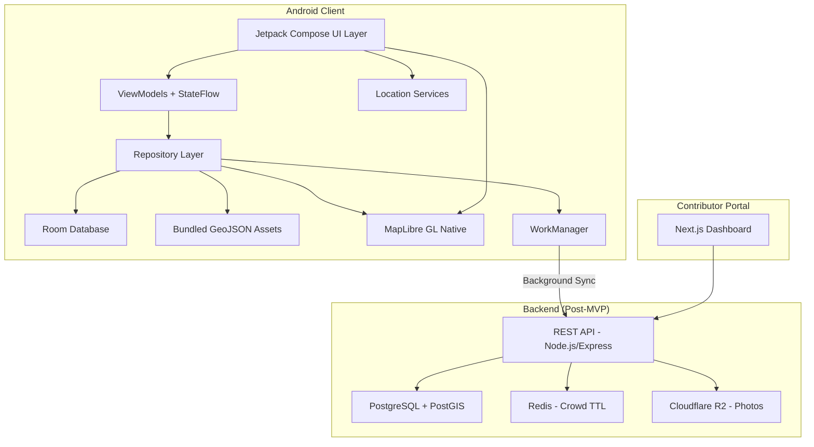
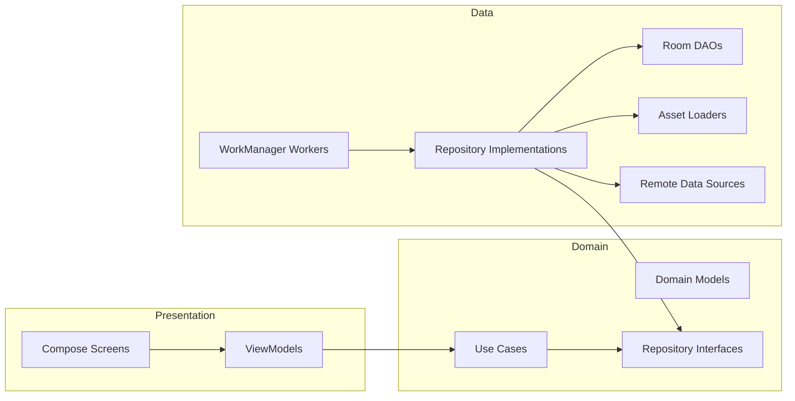

# Design Document: Festival Atlas Android (Hopper)

## Overview

Hopper (Festival Atlas) is an offline-first Android application for navigating Bengal's Durga Puja and Jagaddhatri Puja festivals. The architecture prioritizes zero-network operation, safety-critical emergency routing, and privacy-preserving crowd intelligence.

The system is composed of three main layers:
1. **Android Client** — Kotlin/Jetpack Compose app with MapLibre GL Native for offline map rendering, Room database for persistence, and WorkManager for background sync
2. **Backend API** — Node.js/Express with PostgreSQL + PostGIS for spatial queries, Redis for crowd data TTL, and S3-compatible storage for photos
3. **Contributor Portal** — Next.js web dashboard for puja committees to manage pandal data

The MVP (v0.1) focuses exclusively on the Android client with bundled offline data, deferring backend sync to post-MVP iterations.

### Key Design Decisions

| Decision | Choice | Rationale |
|----------|--------|-----------|
| Map Engine | MapLibre GL Native | Zero-cost at scale, native offline tile caching via OfflineManager, open-source |
| Local DB | Room + SQLite | First-class Android support, compile-time query verification, Flow integration |
| Spatial Queries | Haversine formula in SQL | Room doesn't support PostGIS; Haversine on lat/lng columns is sufficient for <50km radius |
| DI Framework | Hilt | Standard for Android, integrates with WorkManager and ViewModel |
| Background Sync | WorkManager | Survives process death, respects battery constraints, supports network-conditional execution |
| State Management | ViewModel + StateFlow | Compose-native, lifecycle-aware, testable |
| Navigation | Jetpack Navigation Compose | Type-safe routes, deep link support |
| Offline Strategy | Bundled assets + Room cache | GeoJSON bundled in APK assets; crowd/sync data in Room |


## Architecture

### High-Level Architecture Diagram



### Layered Architecture (Clean Architecture)




### Package Structure

```
com.example.hopper/
├── di/                          # Hilt modules
│   ├── DatabaseModule.kt
│   ├── RepositoryModule.kt
│   └── LocationModule.kt
├── data/
│   ├── local/
│   │   ├── db/
│   │   │   ├── HopperDatabase.kt
│   │   │   ├── dao/
│   │   │   │   ├── PandalDao.kt
│   │   │   │   ├── ExitNodeDao.kt
│   │   │   │   ├── CrowdReportDao.kt
│   │   │   │   ├── CalendarDao.kt
│   │   │   │   ├── ItineraryDao.kt
│   │   │   │   ├── LightTrailDao.kt
│   │   │   │   ├── BhogDao.kt
│   │   │   │   └── ProcessionDao.kt
│   │   │   └── entity/
│   │   │       ├── PandalEntity.kt
│   │   │       ├── ExitNodeEntity.kt
│   │   │       ├── CrowdReportEntity.kt
│   │   │       ├── ConnectorEntity.kt
│   │   │       ├── TithiEntity.kt
│   │   │       ├── LightTrailEntity.kt
│   │   │       ├── BhogPinEntity.kt
│   │   │       ├── ProcessionEntity.kt
│   │   │       ├── ProcessionReportEntity.kt
│   │   │       └── HistoricalCrowdPatternEntity.kt
│   │   └── assets/
│   │       └── GeoJsonAssetLoader.kt
│   ├── remote/
│   │   ├── api/
│   │   │   ├── HopperApiService.kt
│   │   │   └── dto/
│   │   └── sync/
│   │       ├── DataSyncWorker.kt
│   │       ├── CrowdUploadWorker.kt
│   │       ├── BhogUploadWorker.kt
│   │       └── ProcessionUploadWorker.kt
│   └── repository/
│       ├── PandalRepositoryImpl.kt
│       ├── ExitRouterRepositoryImpl.kt
│       ├── CrowdReportRepositoryImpl.kt
│       ├── CalendarRepositoryImpl.kt
│       ├── LightTrailRepositoryImpl.kt
│       ├── BhogRepositoryImpl.kt
│       └── BishorjonRepositoryImpl.kt
├── domain/
│   ├── model/
│   │   ├── Pandal.kt
│   │   ├── ExitNode.kt
│   │   ├── CrowdReport.kt
│   │   ├── CrowdBucket.kt
│   │   ├── Festival.kt
│   │   ├── Tithi.kt
│   │   ├── Itinerary.kt
│   │   ├── LightTrail.kt
│   │   ├── BhogPin.kt
│   │   ├── ProcessionRoute.kt
│   │   └── HistoricalCrowdPattern.kt
│   ├── repository/
│   │   ├── PandalRepository.kt
│   │   ├── ExitRouterRepository.kt
│   │   ├── CrowdReportRepository.kt
│   │   ├── CalendarRepository.kt
│   │   ├── LightTrailRepository.kt
│   │   ├── BhogRepository.kt
│   │   └── BishorjonRepository.kt
│   └── usecase/
│       ├── GetNearestPandalsUseCase.kt
│       ├── GetExitRoutesUseCase.kt
│       ├── SubmitCrowdReportUseCase.kt
│       ├── BuildItineraryUseCase.kt
│       ├── ToggleFestivalUseCase.kt
│       ├── GetLightTrailUseCase.kt
│       ├── SubmitBhogReportUseCase.kt
│       ├── GetBhogPinsUseCase.kt
│       ├── ProcessionTrackerUseCase.kt
│       └── GetPredictiveWaitTimesUseCase.kt
├── ui/
│   ├── map/
│   │   ├── MapScreen.kt
│   │   ├── MapViewModel.kt
│   │   └── components/
│   │       ├── PandalPin.kt
│   │       ├── ExitNodePin.kt
│   │       └── GracefulDegradationView.kt
│   ├── nearme/
│   │   ├── NearMeScreen.kt
│   │   └── NearMeViewModel.kt
│   ├── detail/
│   │   ├── PandalDetailSheet.kt
│   │   ├── PandalDetailViewModel.kt
│   │   └── components/
│   │       └── HeatTimelineBar.kt
│   ├── emergency/
│   │   ├── ExitRouterSheet.kt
│   │   └── ExitRouterViewModel.kt
│   ├── crowd/
│   │   ├── CrowdReportSheet.kt
│   │   └── CrowdReportViewModel.kt
│   ├── calendar/
│   │   ├── CalendarScreen.kt
│   │   └── CalendarViewModel.kt
│   ├── itinerary/
│   │   ├── ItineraryScreen.kt
│   │   └── ItineraryViewModel.kt
│   ├── lighttrail/
│   │   ├── LightTrailScreen.kt
│   │   └── LightTrailViewModel.kt
│   ├── bhog/
│   │   ├── BhogFinderSheet.kt
│   │   └── BhogFinderViewModel.kt
│   ├── bishorjon/
│   │   ├── BishorjonTrackerSheet.kt
│   │   └── BishorjonTrackerViewModel.kt
│   └── theme/
│       ├── HopperTheme.kt
│       ├── NightSafetyTheme.kt
│       └── Typography.kt
└── util/
    ├── LocationUtils.kt
    ├── HaversineCalculator.kt
    ├── DeviceHashUtil.kt
    ├── DateTimeUtils.kt
    ├── LocaleManager.kt
    └── StringProvider.kt
```


## Components and Interfaces

### 1. Map Engine (MapLibre GL Native)

The map engine wraps MapLibre GL Native for Android, providing offline tile rendering and GeoJSON overlay management.

**Key Integration Points:**
- `MapLibreMap` instance managed within a Compose `AndroidView` wrapper
- `OfflineManager` for downloading and managing offline tile regions (Kolkata, Chandannagar, Krishnanagar)
- `Style` loaded from bundled JSON or remote URL with fallback
- GeoJSON sources added as `GeoJsonSource` layers for pandal pins, exit nodes, and route polylines

```kotlin
interface MapEngineController {
    fun loadOfflineRegion(bounds: LatLngBounds, minZoom: Double, maxZoom: Double)
    fun setGeoJsonSource(sourceId: String, geoJson: String)
    fun addPandalPins(pandals: List<Pandal>)
    fun addExitNodePins(exitNodes: List<ExitNode>)
    fun showRoutePolyline(routeId: String, coordinates: List<LatLng>)
    fun switchToGracefulDegradation()
    fun switchToFullMap()
    fun setNightSafetyStyle(enabled: Boolean)
    fun centerOnLocation(latLng: LatLng, zoom: Double)

    // Light Trail (Requirement 15)
    fun showLightTrailOverlay(trailStops: List<LightTrailStop>, routePolyline: List<LatLng>)
    fun hideLightTrailOverlay()
    fun highlightLightTrailStop(stopId: String)

    // Bishorjon Procession Tracker (Requirement 16)
    fun showProcessionRoute(routeId: String, coordinates: List<LatLng>, directionDegrees: Float)
    fun animateProcessionSegment(segmentId: String, coordinates: List<LatLng>, isActive: Boolean)
    fun clearProcessionRoutes()

    // Bhog & Food Finder (Requirement 17)
    fun addBhogPins(pins: List<BhogPin>)
    fun setBhogCategoryFilter(categories: Set<BhogCategory>)
    fun clearBhogPins()
}
```

**Offline Strategy:**
- On first launch (or when network available), download tile pyramid regions via `OfflineManager.createOfflineRegion()`
- Regions defined as `OfflineTilePyramidRegionDefinition` with bounding boxes for each city zone
- Target: zoom levels 10–16, total cache < 50MB across all regions
- Bundled GeoJSON in `assets/` folder for pandal coordinates (always available, no download needed)

### 2. Festival Toggle

```kotlin
data class FestivalContext(
    val festival: Festival,
    val year: Int
)

enum class Festival {
    DURGA_PUJA,
    JAGADDHATRI_PUJA
}

interface FestivalToggleController {
    val currentContext: StateFlow<FestivalContext>
    fun toggle(festival: Festival)
    fun setYear(year: Int)
    fun getDefaultFestival(currentDate: LocalDate): Festival
}
```

The toggle determines which dataset is active. All repository queries filter by `(festival, year)` pair. Default selection uses proximity to festival dates from the bundled calendar JSON.


### 3. Exit Router

The Exit Router calculates offline walking routes from the user's current position to the nearest emergency service points.

```kotlin
data class ExitRoute(
    val exitNode: ExitNode,
    val distanceMeters: Double,
    val estimatedWalkingMinutes: Int,
    val polyline: List<LatLng>,
    val isAlternate: Boolean
)

interface ExitRouterRepository {
    suspend fun getNearestExitNodes(
        location: LatLng,
        festival: Festival,
        year: Int
    ): Map<ExitNodeCategory, List<ExitRoute>>

    suspend fun getAlternateRoutes(
        from: LatLng,
        to: ExitNode
    ): List<ExitRoute>
}

enum class ExitNodeCategory {
    METRO, RAILWAY, POLICE, MEDICAL
}
```

**Routing Strategy:**
- Precomputed walking connector polylines stored in Room (not real-time routing)
- Each pandal has at least 2 connector polylines per nearby exit node
- Distance calculated via Haversine; walking time estimated at 5 km/h average
- Night Safety Mode applies a preference weight for well-lit main roads (tagged in connector metadata)

### 4. Crowd Reporter

```kotlin
data class CrowdReport(
    val id: String,
    val pandalId: String,
    val bucket: CrowdBucket,
    val deviceHash: String,
    val reportedAt: Instant,
    val expiresAt: Instant,
    val isSynced: Boolean
)

enum class CrowdBucket(val label: String, val waitMinutes: Int) {
    GREEN("Under 10 min", 10),
    YELLOW("~25 min", 25),
    RED("60+ min", 60)
}

interface CrowdReportRepository {
    suspend fun submitReport(pandalId: String, bucket: CrowdBucket): Result<Unit>
    fun getAggregatedCrowd(pandalId: String): Flow<CrowdBucket?>
    suspend fun canReport(pandalId: String): Boolean  // rate limit check
    suspend fun expireStaleReports()
    suspend fun syncPendingReports()

    // Predictive Wait Times (Requirement 18)
    suspend fun getHistoricalCrowdPatterns(
        pandalId: String,
        festival: Festival,
        tithiName: String
    ): List<HistoricalCrowdPattern>
}
```

**Privacy Design:**
- `DeviceHash` = SHA-256(Android `Settings.Secure.ANDROID_ID`)
- No user registration, no PII collection
- Reports stripped of all metadata except: pandalId, bucket, deviceHash, timestamp
- Rate limit: 1 report per pandal per 10 minutes per device (enforced locally via Room query)

### 5. Itinerary Builder

```kotlin
data class Itinerary(
    val id: String,
    val stops: List<ItineraryStop>,
    val totalDistanceKm: Double,
    val totalWalkingMinutes: Int,
    val createdAt: Instant
)

data class ItineraryStop(
    val sequence: Int,
    val pandal: Pandal,
    val distanceFromPreviousMeters: Double,
    val estimatedArrivalTime: Instant,
    val currentCrowdBucket: CrowdBucket?
)

interface ItineraryBuilder {
    suspend fun buildItinerary(
        selectedPandals: List<Pandal>,
        startLocation: LatLng,
        startTime: Instant
    ): Itinerary

    suspend fun updateEstimates(
        itinerary: Itinerary,
        currentLocation: LatLng,
        currentTime: Instant
    ): Itinerary
}
```

**Algorithm:**
- Nearest-neighbor proximity chaining with crowd penalty
- Crowd penalty: RED pandals get a 2x distance multiplier, pushing them later in the route
- Walking speed: 4 km/h (accounting for festival crowd density)
- All computation uses locally cached GPS coordinates


### 6. Chandannagar Light Trail

The Light Trail provides a curated walking route overlay for Chandannagar's famous lighting installations during Jagaddhatri Puja.

```kotlin
data class LightTrailStop(
    val id: String,
    val name: String,
    val nameBengali: String?,
    val location: LatLng,
    val artistName: String?,
    val dimensions: String?,
    val themeDescription: String?,
    val themeDescriptionBengali: String?,
    val photoUrl: String?,
    val sequence: Int,
    val viewingAngleDegrees: Float?,
    val isVantagePoint: Boolean
)

data class LightTrail(
    val id: String,
    val festival: Festival,
    val year: Int,
    val stops: List<LightTrailStop>,
    val routePolyline: List<LatLng>,
    val totalDistanceKm: Double,
    val estimatedWalkingMinutes: Int,
    val startPoint: LatLng,
    val endPoint: LatLng
)

interface LightTrailRepository {
    suspend fun getLightTrail(festival: Festival, year: Int): LightTrail?
    suspend fun getLightTrailStop(stopId: String): LightTrailStop?
}
```

**Use Case:**

```kotlin
class GetLightTrailUseCase @Inject constructor(
    private val lightTrailRepository: LightTrailRepository,
    private val festivalToggleController: FestivalToggleController
) {
    suspend operator fun invoke(): LightTrail? {
        val context = festivalToggleController.currentContext.value
        if (context.festival != Festival.JAGADDHATRI_PUJA) return null
        return lightTrailRepository.getLightTrail(context.festival, context.year)
    }
}
```

**UI Components:**
- `LightTrailScreen.kt` — Full-screen map view with the trail overlay active, showing sequential stop markers and the route polyline
- `LightTrailViewModel.kt` — Manages trail state, current stop selection, and distance calculations

**Map Integration:**
- `showLightTrailOverlay()` renders the route as a styled polyline with numbered stop markers
- Vantage points rendered as distinct pin icons with viewing-angle indicator arcs
- Only available when `Festival_Toggle` is set to Jagaddhatri Puja


### 7. Bishorjon Procession Tracker

The Bishorjon Tracker displays live crowd-reported procession routes during Jagaddhatri Puja's immersion night, allowing spectators to position themselves or avoid congested corridors.

```kotlin
data class ProcessionRoute(
    val id: String,
    val pandalName: String,
    val pandalNameBengali: String?,
    val segments: List<ProcessionSegment>,
    val lastReportedAt: Instant,
    val isActive: Boolean
)

data class ProcessionSegment(
    val id: String,
    val coordinates: List<LatLng>,
    val directionDegrees: Float,
    val reportedAt: Instant,
    val isStale: Boolean  // true if > 15 minutes old
)

data class ProcessionReport(
    val id: String,
    val pandalId: String,
    val location: LatLng,
    val deviceHash: String,
    val reportedAt: Instant,
    val expiresAt: Instant,  // reportedAt + 15 minutes
    val isSynced: Boolean
)

interface BishorjonRepository {
    fun getActiveProcessions(festival: Festival, year: Int): Flow<List<ProcessionRoute>>
    suspend fun submitProcessionReport(pandalId: String, location: LatLng): Result<Unit>
    suspend fun getEstimatedArrivalMinutes(userLocation: LatLng): Int?
    suspend fun expireStaleProcessionReports()
    suspend fun syncPendingProcessionReports()
    fun getLastKnownProcessions(): Flow<List<ProcessionRoute>>  // offline fallback
}
```

**Use Case:**

```kotlin
class ProcessionTrackerUseCase @Inject constructor(
    private val bishorjonRepository: BishorjonRepository,
    private val locationProvider: LocationProvider,
    private val festivalToggleController: FestivalToggleController
) {
    fun observeActiveProcessions(): Flow<List<ProcessionRoute>> {
        val context = festivalToggleController.currentContext.value
        return bishorjonRepository.getActiveProcessions(context.festival, context.year)
    }

    suspend fun reportProcessionSighting(pandalId: String): Result<Unit> {
        val location = locationProvider.currentLocation.value ?: return Result.failure(
            IllegalStateException("Location unavailable")
        )
        return bishorjonRepository.submitProcessionReport(pandalId, location)
    }

    suspend fun getETA(): Int? {
        val location = locationProvider.currentLocation.value ?: return null
        return bishorjonRepository.getEstimatedArrivalMinutes(location)
    }
}
```

**UI Components:**
- `BishorjonTrackerSheet.kt` — Bottom sheet showing active processions list with ETA, report button, and proximity alerts
- `BishorjonTrackerViewModel.kt` — Manages procession state, proximity detection (500m threshold), and audio/vibration alerts

**Map Integration:**
- `showProcessionRoute()` renders animated polylines with directional arrows indicating movement direction
- `animateProcessionSegment()` applies a pulsing/flowing animation to active segments
- Active segments use a distinct color (e.g., saffron/orange) with animated dashes showing direction
- Stale segments (>15 min) rendered with reduced opacity and a staleness timestamp label

**Proximity Alert Logic:**
- When any active procession segment is within 500 meters of user location, trigger:
  - Audio alert (short notification sound)
  - Device vibration (200ms pulse)
  - Visual banner in the tracker sheet showing "Procession approaching — ~X min away"

**Offline Behavior:**
- When no network is available, display last-known procession positions from locally cached reports
- Show staleness indicator with timestamp of last update
- Queue new procession reports locally for upload when connectivity restores


### 8. Bhog and Food Finder

The Bhog Finder displays community-reported food distribution points and street food stalls near pandal zones.

```kotlin
data class BhogPin(
    val id: String,
    val category: BhogCategory,
    val name: String,
    val nameBengali: String?,
    val location: LatLng,
    val committeeName: String?,  // for bhog distribution
    val reportedStartTime: Instant?,
    val expectedEndTime: Instant?,
    val communityRating: Float?,  // 1.0-5.0, for street food
    val distanceFromUserMeters: Double?,
    val reportedAt: Instant,
    val expiresAt: Instant,
    val isSynced: Boolean
)

enum class BhogCategory {
    BHOG_DISTRIBUTION,
    STREET_FOOD
}

interface BhogRepository {
    fun getBhogPins(
        festival: Festival,
        year: Int,
        categories: Set<BhogCategory>,
        userLocation: LatLng?
    ): Flow<List<BhogPin>>

    suspend fun submitBhogReport(
        category: BhogCategory,
        name: String,
        location: LatLng,
        startTime: Instant?,
        endTime: Instant?
    ): Result<Unit>

    suspend fun submitFoodRating(pinId: String, rating: Float): Result<Unit>
    suspend fun expireStaleReports()
    suspend fun syncPendingReports()
}
```

**Use Cases:**

```kotlin
class GetBhogPinsUseCase @Inject constructor(
    private val bhogRepository: BhogRepository,
    private val locationProvider: LocationProvider,
    private val festivalToggleController: FestivalToggleController
) {
    fun invoke(categories: Set<BhogCategory>): Flow<List<BhogPin>> {
        val context = festivalToggleController.currentContext.value
        return bhogRepository.getBhogPins(
            context.festival,
            context.year,
            categories,
            locationProvider.currentLocation.value
        )
    }
}

class SubmitBhogReportUseCase @Inject constructor(
    private val bhogRepository: BhogRepository,
    private val locationProvider: LocationProvider
) {
    suspend operator fun invoke(
        category: BhogCategory,
        name: String,
        startTime: Instant?,
        endTime: Instant?
    ): Result<Unit> {
        val location = locationProvider.currentLocation.value
            ?: return Result.failure(IllegalStateException("Location unavailable"))
        return bhogRepository.submitBhogReport(category, name, location, startTime, endTime)
    }
}
```

**UI Components:**
- `BhogFinderSheet.kt` — Bottom sheet with category toggle (Bhog Distribution / Street Food), pin list sorted by distance, and quick-report button (3 taps max)
- `BhogFinderViewModel.kt` — Manages category filter state, pin list, and report submission

**Map Integration:**
- `addBhogPins()` renders food pins with distinct icons per category (plate icon for bhog, fork icon for street food)
- `setBhogCategoryFilter()` toggles visibility of pin categories on the map without re-fetching data
- Distance from user displayed on each pin label

**Expiry Logic:**
- Bhog distribution pins expire at `min(reportedEndTime, reportedAt + 2 hours)`
- Street food pins persist for 24 hours unless manually removed
- Expired pins removed from display during periodic cleanup


### 9. Predictive Wait Times

The Predictive Crowd system displays historical crowd patterns as a heat timeline bar on pandal detail cards, helping users time their visits.

```kotlin
data class HistoricalCrowdPattern(
    val id: String,
    val pandalId: String,
    val festival: Festival,
    val tithiName: String,  // e.g., "Ashtami", "Navami"
    val hourOfDay: Int,     // 0-23
    val predictedBucket: CrowdBucket,
    val confidencePercent: Int,  // 0-100
    val sampleYears: Int   // number of years of data backing this prediction
)

data class PredictiveTimeline(
    val pandalId: String,
    val tithiName: String,
    val hourlyPredictions: List<HourlyPrediction>,
    val peakSummary: String  // e.g., "Historically VERY CROWDED on Ashtami night between 9PM–12AM"
)

data class HourlyPrediction(
    val hourOfDay: Int,
    val predictedBucket: CrowdBucket,
    val confidencePercent: Int
)
```

**Use Case:**

```kotlin
class GetPredictiveWaitTimesUseCase @Inject constructor(
    private val crowdReportRepository: CrowdReportRepository,
    private val calendarRepository: CalendarRepository,
    private val festivalToggleController: FestivalToggleController
) {
    suspend operator fun invoke(pandalId: String): PredictiveTimeline? {
        val context = festivalToggleController.currentContext.value
        val currentTithi = calendarRepository.getCurrentTithi(context.festival, context.year)
            ?: return null
        val patterns = crowdReportRepository.getHistoricalCrowdPatterns(
            pandalId, context.festival, currentTithi.name
        )
        if (patterns.isEmpty()) return null
        return PredictiveTimeline(
            pandalId = pandalId,
            tithiName = currentTithi.name,
            hourlyPredictions = patterns.map { HourlyPrediction(it.hourOfDay, it.predictedBucket, it.confidencePercent) },
            peakSummary = generatePeakSummary(patterns, currentTithi.name)
        )
    }

    private fun generatePeakSummary(patterns: List<HistoricalCrowdPattern>, tithiName: String): String {
        val peakHours = patterns.filter { it.predictedBucket == CrowdBucket.RED }
        if (peakHours.isEmpty()) return "No historically heavy crowds on $tithiName"
        val startHour = peakHours.minOf { it.hourOfDay }
        val endHour = peakHours.maxOf { it.hourOfDay } + 1
        return "Historically VERY CROWDED on $tithiName night between ${formatHour(startHour)}–${formatHour(endHour)}"
    }
}
```

**UI Component — HeatTimelineBar.kt:**
- Horizontal bar divided into hourly segments (typically 6PM–2AM for evening visits)
- Each segment colored by predicted CrowdBucket (green/yellow/red)
- Current hour highlighted with a marker
- Textual peak summary displayed below the bar
- When live crowd data is available, live indicator overlays the predictive bar with higher visual priority

**Data Source:**
- All historical patterns stored in `HistoricalCrowdPatternEntity` in Room
- Bundled as offline data — no network required for predictions
- Heuristic rules: Ashtami/Navami nights 9PM–12AM default to RED if no historical data exists


### 10. Bilingual Language Support

The language system provides dynamic Bengali/English switching across the entire app, using the Hind Siliguri font for Bengali text rendering in Jetpack Compose.

```kotlin
/**
 * Manages app-wide locale state and persistence.
 * Handles dynamic language switching without requiring Activity restart.
 */
class LocaleManager @Inject constructor(
    private val preferences: SharedPreferences
) {
    companion object {
        const val KEY_LOCALE = "app_locale"
        const val LOCALE_BENGALI = "bn"
        const val LOCALE_ENGLISH = "en"
    }

    private val _currentLocale = MutableStateFlow(getSavedLocale())
    val currentLocale: StateFlow<String> = _currentLocale.asStateFlow()

    fun setLocale(localeCode: String) {
        preferences.edit().putString(KEY_LOCALE, localeCode).apply()
        _currentLocale.value = localeCode
    }

    fun getSavedLocale(): String {
        return preferences.getString(KEY_LOCALE, getSystemDefault()) ?: LOCALE_ENGLISH
    }

    private fun getSystemDefault(): String {
        val systemLang = Locale.getDefault().language
        return if (systemLang == LOCALE_BENGALI) LOCALE_BENGALI else LOCALE_ENGLISH
    }

    fun isBengali(): Boolean = _currentLocale.value == LOCALE_BENGALI
}

/**
 * Provides localized strings for domain/data layers that don't have
 * direct access to Android Context resources.
 * Resolves bilingual fields (name vs nameBengali) based on current locale.
 */
class StringProvider @Inject constructor(
    private val localeManager: LocaleManager
) {
    fun resolve(english: String?, bengali: String?): String {
        return if (localeManager.isBengali()) {
            bengali ?: english ?: ""
        } else {
            english ?: bengali ?: ""
        }
    }

    fun resolveNullable(english: String?, bengali: String?): String? {
        return if (localeManager.isBengali()) bengali ?: english else english ?: bengali
    }
}
```

**Typography Strategy (Typography.kt):**

```kotlin
// Custom font loading for Hind Siliguri (Bengali-compatible)
private val HindSiliguri = FontFamily(
    Font(R.font.hind_siliguri_regular, FontWeight.Normal),
    Font(R.font.hind_siliguri_medium, FontWeight.Medium),
    Font(R.font.hind_siliguri_semibold, FontWeight.SemiBold),
    Font(R.font.hind_siliguri_bold, FontWeight.Bold),
    Font(R.font.hind_siliguri_light, FontWeight.Light)
)

private val DefaultLatinFont = FontFamily(
    Font(R.font.inter_regular, FontWeight.Normal),
    Font(R.font.inter_medium, FontWeight.Medium),
    Font(R.font.inter_semibold, FontWeight.SemiBold),
    Font(R.font.inter_bold, FontWeight.Bold)
)

/**
 * Returns the appropriate Typography based on current locale.
 * Bengali locale uses Hind Siliguri; English uses Inter.
 */
@Composable
fun hopperTypography(localeManager: LocaleManager): Typography {
    val isBengali = localeManager.currentLocale.collectAsState().value == LocaleManager.LOCALE_BENGALI
    val fontFamily = if (isBengali) HindSiliguri else DefaultLatinFont

    return Typography(
        displayLarge = TextStyle(fontFamily = fontFamily, fontSize = 57.sp, fontWeight = FontWeight.Normal),
        headlineLarge = TextStyle(fontFamily = fontFamily, fontSize = 32.sp, fontWeight = FontWeight.SemiBold),
        headlineMedium = TextStyle(fontFamily = fontFamily, fontSize = 28.sp, fontWeight = FontWeight.Medium),
        titleLarge = TextStyle(fontFamily = fontFamily, fontSize = 22.sp, fontWeight = FontWeight.Medium),
        titleMedium = TextStyle(fontFamily = fontFamily, fontSize = 16.sp, fontWeight = FontWeight.Medium),
        bodyLarge = TextStyle(fontFamily = fontFamily, fontSize = 16.sp, fontWeight = FontWeight.Normal),
        bodyMedium = TextStyle(fontFamily = fontFamily, fontSize = 14.sp, fontWeight = FontWeight.Normal),
        labelLarge = TextStyle(fontFamily = fontFamily, fontSize = 14.sp, fontWeight = FontWeight.Medium),
        labelMedium = TextStyle(fontFamily = fontFamily, fontSize = 12.sp, fontWeight = FontWeight.Medium)
    )
}
```

**Font Asset Requirements:**
- Bundle `hind_siliguri_*.ttf` files in `res/font/` directory
- Bundle `inter_*.ttf` for Latin script
- Total font bundle size target: < 1.5MB

**Integration with HopperTheme:**
- `HopperTheme` composable accepts `LocaleManager` and passes locale-aware typography to `MaterialTheme`
- Language switch is reactive via `StateFlow` — UI recomposes automatically when locale changes
- No Activity restart required for language switching


### 11. Offline Cache & Sync

```kotlin
@Database(
    entities = [
        PandalEntity::class,
        ExitNodeEntity::class,
        ConnectorEntity::class,
        CrowdReportEntity::class,
        TithiEntity::class,
        ItineraryEntity::class,
        ItineraryStopEntity::class,
        EditionEntity::class,
        LightTrailEntity::class,
        BhogPinEntity::class,
        ProcessionEntity::class,
        ProcessionReportEntity::class,
        HistoricalCrowdPatternEntity::class
    ],
    version = 1
)
@TypeConverters(Converters::class)
abstract class HopperDatabase : RoomDatabase() {
    abstract fun pandalDao(): PandalDao
    abstract fun exitNodeDao(): ExitNodeDao
    abstract fun crowdReportDao(): CrowdReportDao
    abstract fun calendarDao(): CalendarDao
    abstract fun itineraryDao(): ItineraryDao
    abstract fun editionDao(): EditionDao
    abstract fun lightTrailDao(): LightTrailDao
    abstract fun bhogDao(): BhogDao
    abstract fun processionDao(): ProcessionDao
}
```

**Sync Strategy (Stale-While-Revalidate):**
1. App always serves data from Room immediately (zero-latency UX)
2. WorkManager schedules periodic sync (minimum 15-minute interval)
3. Sync worker checks `If-Modified-Since` header against backend
4. If new data available, upserts into Room; UI observes via Flow and updates reactively
5. Crowd reports queued locally when offline; uploaded on connectivity restore

```kotlin
class DataSyncWorker(
    context: Context,
    params: WorkerParameters
) : CoroutineWorker(context, params) {

    override suspend fun doWork(): Result {
        // 1. Sync pandal data
        // 2. Sync exit node data
        // 3. Upload pending crowd reports
        // 4. Download latest crowd aggregations
        return Result.success()
    }
}
```

**WorkManager Configuration:**
- Constraints: `NetworkType.CONNECTED`, `BatteryNotLow`
- Retry policy: Exponential backoff starting at 30 seconds
- Unique work name per sync type to prevent duplicates

### 12. Location Services

```kotlin
interface LocationProvider {
    val currentLocation: StateFlow<LatLng?>
    val isLocationAvailable: StateFlow<Boolean>
    fun startTracking()
    fun stopTracking()
    fun setStationaryTimeout(minutes: Int)  // default: 2 min
}
```

**Battery Optimization:**
- GPS polling interval: 10 seconds when moving, paused when stationary > 2 minutes
- Motion detection via `ActivityRecognitionClient` or accelerometer threshold
- Resume polling on motion detected
- Target: < 15% battery over 6-hour session


## Data Models

### Room Entity Definitions

```kotlin
@Entity(tableName = "pandals")
data class PandalEntity(
    @PrimaryKey val id: String,
    val name: String,
    val nameBengali: String?,
    val latitude: Double,
    val longitude: Double,
    val city: String,
    val neighborhood: String?,
    val festival: String,  // "DURGA_PUJA" or "JAGADDHATRI_PUJA"
    val year: Int,
    val theme: String?,
    val themeBengali: String?,
    val committeeName: String?,
    val committeeNameBengali: String?,
    val establishedYear: Int?,
    val idolMaker: String?,
    val lightingDesigner: String?,
    val themeDesigner: String?,
    val awards: String?,  // JSON array serialized
    val photos: String?,  // JSON array of URLs
    val significanceRank: Int,  // 1-5, used for composite scoring
    val sourceType: String,  // "committee", "volunteer", "news", "unknown"
    val confidenceLevel: String,  // "low", "medium", "high"
    val lastUpdated: Long
)

@Entity(tableName = "exit_nodes")
data class ExitNodeEntity(
    @PrimaryKey val id: String,
    val name: String,
    val nameBengali: String?,
    val category: String,  // "METRO", "RAILWAY", "POLICE", "MEDICAL"
    val latitude: Double,
    val longitude: Double,
    val contactNumber: String?,
    val is24Hr: Boolean,
    val isFestivalOnly: Boolean,
    val isWellLit: Boolean  // for Night Safety Mode routing preference
)

@Entity(
    tableName = "connectors",
    foreignKeys = [
        ForeignKey(entity = PandalEntity::class, parentColumns = ["id"], childColumns = ["pandalId"]),
        ForeignKey(entity = ExitNodeEntity::class, parentColumns = ["id"], childColumns = ["exitNodeId"])
    ]
)
data class ConnectorEntity(
    @PrimaryKey val id: String,
    val pandalId: String,
    val exitNodeId: String,
    val polyline: String,  // Encoded polyline string
    val distanceMeters: Double,
    val isWellLit: Boolean,
    val isAlternate: Boolean
)

@Entity(tableName = "crowd_reports")
data class CrowdReportEntity(
    @PrimaryKey val id: String,
    val pandalId: String,
    val bucket: String,  // "GREEN", "YELLOW", "RED"
    val deviceHash: String,
    val reportedAt: Long,  // epoch millis
    val expiresAt: Long,
    val isSynced: Boolean
)

@Entity(tableName = "tithis")
data class TithiEntity(
    @PrimaryKey val id: String,
    val festival: String,
    val year: Int,
    val name: String,
    val nameBengali: String,
    val date: String,  // ISO date
    val significance: String?,
    val significanceBengali: String?,
    val isPeakCrowd: Boolean
)

@Entity(tableName = "editions")
data class EditionEntity(
    @PrimaryKey val id: String,
    val pandalId: String,
    val year: Int,
    val theme: String?,
    val themeBengali: String?,
    val idolMaker: String?,
    val lightingDesigner: String?,
    val awards: String?,  // JSON array
    val photos: String?,  // JSON array of URLs
    val sourceType: String,
    val confidenceLevel: String
)

@Entity(tableName = "light_trail_stops")
data class LightTrailEntity(
    @PrimaryKey val id: String,
    val festival: String,
    val year: Int,
    val name: String,
    val nameBengali: String?,
    val latitude: Double,
    val longitude: Double,
    val artistName: String?,
    val dimensions: String?,
    val themeDescription: String?,
    val themeDescriptionBengali: String?,
    val photoUrl: String?,
    val sequence: Int,
    val viewingAngleDegrees: Float?,
    val isVantagePoint: Boolean,
    val routePolyline: String?  // Encoded polyline for trail segment to next stop
)

@Entity(tableName = "bhog_pins")
data class BhogPinEntity(
    @PrimaryKey val id: String,
    val category: String,  // "BHOG_DISTRIBUTION" or "STREET_FOOD"
    val name: String,
    val nameBengali: String?,
    val latitude: Double,
    val longitude: Double,
    val committeeName: String?,
    val reportedStartTime: Long?,
    val expectedEndTime: Long?,
    val communityRating: Float?,
    val deviceHash: String,
    val reportedAt: Long,
    val expiresAt: Long,
    val isSynced: Boolean
)

@Entity(tableName = "processions")
data class ProcessionEntity(
    @PrimaryKey val id: String,
    val pandalId: String,
    val pandalName: String,
    val pandalNameBengali: String?,
    val festival: String,
    val year: Int,
    val routePolyline: String,  // Encoded polyline for the known procession route
    val isActive: Boolean,
    val lastReportedAt: Long
)

@Entity(tableName = "procession_reports")
data class ProcessionReportEntity(
    @PrimaryKey val id: String,
    val processionId: String,
    val pandalId: String,
    val latitude: Double,
    val longitude: Double,
    val deviceHash: String,
    val reportedAt: Long,
    val expiresAt: Long,  // reportedAt + 15 minutes
    val isSynced: Boolean
)

@Entity(tableName = "historical_crowd_patterns")
data class HistoricalCrowdPatternEntity(
    @PrimaryKey val id: String,
    val pandalId: String,
    val festival: String,
    val tithiName: String,
    val hourOfDay: Int,
    val predictedBucket: String,  // "GREEN", "YELLOW", "RED"
    val confidencePercent: Int,
    val sampleYears: Int
)
```


### Domain Models

```kotlin
data class Pandal(
    val id: String,
    val name: String,
    val nameBengali: String?,
    val location: LatLng,
    val city: String,
    val neighborhood: String?,
    val festival: Festival,
    val year: Int,
    val theme: String?,
    val committeeName: String?,
    val establishedYear: Int?,
    val artisanCredits: ArtisanCredits?,
    val awards: List<String>,
    val photos: List<String>,
    val significanceRank: Int,
    val sourceType: SourceType,
    val confidenceLevel: ConfidenceLevel
)

data class ArtisanCredits(
    val idolMaker: String?,
    val lightingDesigner: String?,
    val themeDesigner: String?
)

enum class SourceType { COMMITTEE, VOLUNTEER, NEWS, UNKNOWN }
enum class ConfidenceLevel { LOW, MEDIUM, HIGH }

data class LatLng(val latitude: Double, val longitude: Double)

data class ExitNode(
    val id: String,
    val name: String,
    val nameBengali: String?,
    val category: ExitNodeCategory,
    val location: LatLng,
    val contactNumber: String?,
    val is24Hr: Boolean,
    val isWellLit: Boolean
)

data class Tithi(
    val id: String,
    val festival: Festival,
    val year: Int,
    val name: String,
    val nameBengali: String,
    val date: LocalDate,
    val significance: String?,
    val significanceBengali: String?,
    val isPeakCrowd: Boolean
)

data class LightTrailStop(
    val id: String,
    val name: String,
    val nameBengali: String?,
    val location: LatLng,
    val artistName: String?,
    val dimensions: String?,
    val themeDescription: String?,
    val themeDescriptionBengali: String?,
    val photoUrl: String?,
    val sequence: Int,
    val viewingAngleDegrees: Float?,
    val isVantagePoint: Boolean
)

data class LightTrail(
    val id: String,
    val festival: Festival,
    val year: Int,
    val stops: List<LightTrailStop>,
    val routePolyline: List<LatLng>,
    val totalDistanceKm: Double,
    val estimatedWalkingMinutes: Int,
    val startPoint: LatLng,
    val endPoint: LatLng
)

data class BhogPin(
    val id: String,
    val category: BhogCategory,
    val name: String,
    val nameBengali: String?,
    val location: LatLng,
    val committeeName: String?,
    val reportedStartTime: Instant?,
    val expectedEndTime: Instant?,
    val communityRating: Float?,
    val distanceFromUserMeters: Double?,
    val reportedAt: Instant,
    val expiresAt: Instant,
    val isSynced: Boolean
)

enum class BhogCategory {
    BHOG_DISTRIBUTION,
    STREET_FOOD
}

data class ProcessionRoute(
    val id: String,
    val pandalName: String,
    val pandalNameBengali: String?,
    val segments: List<ProcessionSegment>,
    val lastReportedAt: Instant,
    val isActive: Boolean
)

data class ProcessionSegment(
    val id: String,
    val coordinates: List<LatLng>,
    val directionDegrees: Float,
    val reportedAt: Instant,
    val isStale: Boolean
)

data class HistoricalCrowdPattern(
    val id: String,
    val pandalId: String,
    val festival: Festival,
    val tithiName: String,
    val hourOfDay: Int,
    val predictedBucket: CrowdBucket,
    val confidencePercent: Int,
    val sampleYears: Int
)
```

### Bundled GeoJSON Schema

Pandal data is bundled as GeoJSON in `assets/pandals_{festival}_{year}.geojson`:

```json
{
  "type": "FeatureCollection",
  "features": [
    {
      "type": "Feature",
      "geometry": {
        "type": "Point",
        "coordinates": [88.3639, 22.5726]
      },
      "properties": {
        "id": "pandal_001",
        "name": "Santosh Mitra Square",
        "name_bn": "সন্তোষ মিত্র স্কোয়ার",
        "city": "Kolkata",
        "neighborhood": "Bowbazar",
        "festival": "DURGA_PUJA",
        "year": 2026,
        "theme": "Deep Sea Kingdom",
        "committee": "Santosh Mitra Square Puja Committee",
        "established_year": 1936,
        "significance_rank": 5,
        "source_type": "committee",
        "confidence_level": "high"
      }
    }
  ]
}
```

### Composite Scoring Algorithm (Puja Near Me)

```
score(pandal) = w_distance * normalized_distance
             + w_crowd * crowd_penalty
             + w_significance * (1 - normalized_significance)

where:
  w_distance = 0.5
  w_crowd = 0.3  (GREEN=0, YELLOW=0.5, RED=1.0, UNKNOWN=0.3)
  w_significance = 0.2
  normalized_distance = distance_meters / max_distance_in_set
  normalized_significance = (rank - 1) / 4  (rank 1-5)
```

Lower score = better recommendation. Sorted ascending.


## Correctness Properties

*A property is a characteristic or behavior that should hold true across all valid executions of a system — essentially, a formal statement about what the system should do. Properties serve as the bridge between human-readable specifications and machine-verifiable correctness guarantees.*

### Property 1: Festival context filtering

*For any* pandal dataset containing entries from both festivals and multiple years, when a festival and year context is active, all query results SHALL contain only pandals matching both the active festival AND the active year.

**Validates: Requirements 2.4, 2.5, 2.6**

### Property 2: Default festival selection by date proximity

*For any* calendar date, the default festival selection SHALL be the festival whose scheduled dates are nearest to that date (Durga Puja for dates closer to its tithi range, Jagaddhatri Puja for dates closer to its tithi range).

**Validates: Requirements 2.3**

### Property 3: Composite score sorting invariant

*For any* set of pandals with locations, crowd levels, and significance ranks, and any user location, the "Puja Near Me" list SHALL be sorted in ascending order by the composite score formula (0.5×distance + 0.3×crowd + 0.2×significance).

**Validates: Requirements 3.1**

### Property 4: Exit router nearest-per-category

*For any* user location and set of exit nodes across all categories, the exit router SHALL return the geographically nearest exit node for each category (Metro, Railway, Police, Medical) as measured by Haversine distance.

**Validates: Requirements 4.2**

### Property 5: Walking time calculation consistency

*For any* route with a known distance in meters, the estimated walking time SHALL equal `ceil(distanceMeters / (walkingSpeedKmh * 1000 / 60))` minutes, where walking speed is the configured constant (5 km/h normal, 4 km/h in itinerary mode).

**Validates: Requirements 4.4, 14.3**

### Property 6: Crowd report privacy invariant

*For any* crowd report submitted through the system, the report SHALL contain only pandalId, bucket, deviceHash (SHA-256), and timestamp fields — no personally identifiable information (name, email, phone, raw device ID) SHALL be present in the stored or transmitted report.

**Validates: Requirements 5.3, 11.1, 11.2, 11.4**

### Property 7: Crowd report expiry

*For any* crowd report with a `reportedAt` timestamp, the report SHALL be excluded from aggregation results when the current time exceeds `reportedAt + 20 minutes`.

**Validates: Requirements 5.5**

### Property 8: Weighted median crowd aggregation

*For any* set of non-expired crowd reports for a single pandal, the displayed crowd bucket SHALL be the weighted median of the reported bucket values within the 20-minute expiry window.

**Validates: Requirements 5.6**

### Property 9: Crowd report rate limiting

*For any* device hash and pandal ID pair, a crowd report submission SHALL be rejected if a report from the same device for the same pandal exists with a `reportedAt` timestamp less than 10 minutes before the current time.

**Validates: Requirements 5.7**

### Property 10: Night safety route preference

*For any* pair of routes to the same exit node where one route is marked `isWellLit=true` and the other `isWellLit=false`, when Night Safety Mode is active, the well-lit route SHALL be preferred regardless of whether it is longer in distance.

**Validates: Requirements 7.2**

### Property 11: Locale resolution for bilingual fields

*For any* entity with both English and Bengali text fields, when the locale is set to Bengali the system SHALL display the Bengali field (falling back to English if Bengali is null), and when the locale is set to English the system SHALL display the English field (falling back to Bengali if English is null).

**Validates: Requirements 10.2, 10.4**

### Property 12: Itinerary nearest-neighbor with crowd penalty

*For any* set of 5-10 selected pandals with locations and crowd levels, the generated itinerary SHALL follow nearest-neighbor ordering where RED-bucket pandals have their effective distance multiplied by 2x, resulting in red-crowd pandals appearing later in the sequence.

**Validates: Requirements 14.1, 14.2**

### Property 13: Itinerary distance invariant

*For any* generated itinerary, the `totalDistanceKm` SHALL equal the sum of all `distanceFromPreviousMeters` values across all stops (converted to km), and each stop's distance SHALL equal the Haversine distance from the previous stop's location.

**Validates: Requirements 14.3, 14.5**

### Property 14: Procession report expiry

*For any* procession sighting report with a `reportedAt` timestamp, the report SHALL be marked as stale and excluded from active procession display when the current time exceeds `reportedAt + 15 minutes`.

**Validates: Requirements 16.2, 16.6**

### Property 15: Bhog pin category filtering and expiry

*For any* set of bhog pins and a selected category filter, the displayed pins SHALL include only pins matching the selected categories. Additionally, *for any* bhog distribution pin, it SHALL be removed from display when the current time exceeds `min(expectedEndTime, reportedAt + 2 hours)`.

**Validates: Requirements 17.1, 17.2**

### Property 16: Predictive timeline generation

*For any* pandal with stored historical crowd patterns for a given tithi, the heat timeline bar SHALL display one prediction per hour matching the stored pattern's `predictedBucket` value. When both live crowd data and predictive data exist for the same pandal, live data SHALL be displayed with higher visual priority.

**Validates: Requirements 18.1, 18.5, 18.6**

### Property 17: Data provenance defaults

*For any* edition entry ingested without explicit source attribution, the system SHALL assign `sourceType = UNKNOWN` and `confidenceLevel = LOW` as defaults. For all edition entries, both `sourceType` and `confidenceLevel` fields SHALL be non-null.

**Validates: Requirements 20.1, 20.2, 20.4**


## Error Handling

### Network Errors

| Scenario | Handling Strategy |
|----------|-------------------|
| No network on launch | Serve all data from Room/bundled assets; no error shown to user |
| Network lost during sync | WorkManager retries with exponential backoff (30s, 60s, 120s...) |
| API timeout (>10s) | Cancel request, serve cached data, schedule retry |
| API 4xx errors | Log error, do not retry, serve cached data |
| API 5xx errors | Retry up to 3 times with backoff, then serve cached data |

### Map Engine Errors

| Scenario | Handling Strategy |
|----------|-------------------|
| Tile download failure | Fall back to cached tiles; if none available, switch to Graceful Degradation |
| GeoJSON parse error | Log error, skip malformed features, render remaining valid features |
| MapLibre crash/OOM | Catch exception, switch to Graceful Degradation compass view |
| Offline region creation failure | Retry on next sync cycle; app remains functional with bundled GeoJSON |

### Location Errors

| Scenario | Handling Strategy |
|----------|-------------------|
| Location permission denied | Show explanation dialog; degrade to manual pandal browsing (no distance sorting) |
| GPS unavailable | Use last-known location with staleness indicator; disable auto-recalculation |
| Location accuracy > 100m | Show accuracy warning badge; continue with available location |
| Fused location provider unavailable | Fall back to raw GPS provider |

### Data Errors

| Scenario | Handling Strategy |
|----------|-------------------|
| Room database corruption | Delete and recreate database; re-import from bundled assets |
| Crowd report submission failure | Queue locally with `isSynced=false`; retry via WorkManager |
| Procession report queue overflow (>100 pending) | Drop oldest pending reports, keep most recent 50 |
| Bhog pin with invalid coordinates | Skip pin, log warning, do not display |
| Historical pattern data missing | Show "No prediction available" placeholder on heat timeline |

### Locale/Font Errors

| Scenario | Handling Strategy |
|----------|-------------------|
| Bengali font file missing/corrupt | Fall back to system default sans-serif font |
| Bengali translation missing for a string | Fall back to English string |
| Locale change fails | Retain previous locale, log error |


## Testing Strategy

### Unit Tests (Example-Based)

Unit tests cover specific scenarios, edge cases, and integration points:

- **Composite scoring**: Verify specific pandal sets produce expected sort order
- **Haversine calculation**: Known coordinate pairs produce expected distances (±1m)
- **Festival toggle**: Switching festivals reloads correct dataset
- **Graceful degradation trigger**: Tile failure activates compass view
- **Night safety theme**: Activation changes typography and color scheme
- **Itinerary builder**: Known pandal set produces expected route order
- **Crowd bucket display**: Correct color/label for each bucket level
- **Device hash generation**: Deterministic SHA-256 output for known input
- **Light trail sequencing**: Stops render in correct order from start to end
- **Procession proximity alert**: Alert triggers at exactly 500m threshold
- **Bhog pin expiry**: Pin removed at correct time boundary
- **Heat timeline rendering**: Correct hourly segments for known pattern data
- **Locale switching**: UI recomposes with correct font family

### Property-Based Tests

Property tests validate universal correctness properties using generated inputs. Each test runs a minimum of 100 iterations.

**Library**: [Kotest Property Testing](https://kotest.io/docs/proptest/property-based-testing.html) (Kotlin-native, integrates with JUnit5)

**Configuration**:
- Minimum 100 iterations per property
- Seed-based reproducibility for CI
- Custom generators for domain types (Pandal, ExitNode, CrowdReport, etc.)

**Tag format**: Each test tagged with `// Feature: festival-atlas-android, Property {N}: {title}`

| Property # | Test Description | Key Generators |
|-----------|-----------------|----------------|
| 1 | Festival context filtering | Random pandals with mixed festivals/years |
| 2 | Default festival by date | Random LocalDate values across calendar year |
| 3 | Composite score sorting | Random pandal sets with locations, crowds, ranks |
| 4 | Exit router nearest-per-category | Random exit nodes across categories and locations |
| 5 | Walking time calculation | Random distances (100m–10km) |
| 6 | Crowd report privacy | Random report payloads |
| 7 | Report expiry (20 min) | Random timestamps around expiry boundary |
| 8 | Weighted median aggregation | Random report sets (1–20 reports per pandal) |
| 9 | Rate limit enforcement | Random report sequences with varying timestamps |
| 10 | Night safety route preference | Random route pairs (lit vs unlit) |
| 11 | Locale resolution | Random entities with nullable bilingual fields |
| 12 | Itinerary nearest-neighbor | Random pandal selections (5–10) with crowd levels |
| 13 | Itinerary distance invariant | Random itineraries with known coordinates |
| 14 | Procession report expiry (15 min) | Random procession reports around expiry boundary |
| 15 | Bhog pin filtering and expiry | Random bhog pins with categories and timestamps |
| 16 | Predictive timeline generation | Random historical patterns per pandal/tithi |
| 17 | Data provenance defaults | Random edition entries with/without source fields |

### Integration Tests

- **Room database**: Verify DAO queries return correct filtered results
- **WorkManager**: Verify sync workers execute and handle network conditions
- **MapLibre integration**: Verify GeoJSON sources render on map (instrumented test)
- **Offline operation**: Full flow tests with network disabled
- **Contributor Portal sync**: End-to-end data flow from portal to Android cache

### Instrumented Tests (Android)

- Cold start performance (< 2.5s on 2GB RAM device)
- Battery consumption benchmark (< 15% over 6 hours)
- GPS polling behavior (pause after 2 min stationary)
- Font rendering verification (Hind Siliguri renders Bengali correctly)
- Night Safety Mode visual regression
