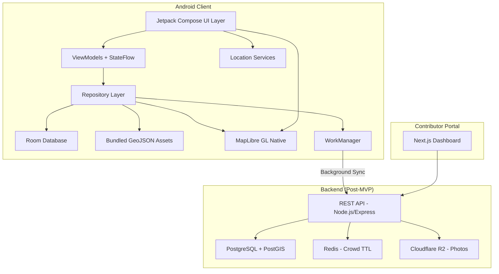
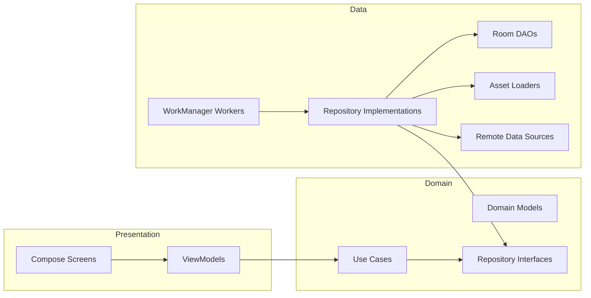

# Design Document: Festival Atlas Android (Hopper)

## Overview

Hopper (Festival Atlas) is an offline-first Android application for navigating Bengal's Durga Puja and Jagaddhatri Puja festivals. The architecture prioritizes zero-network operation, safety-critical emergency routing, and privacy-preserving crowd intelligence.

The system is composed of three main layers:
1. **Android Client** — Kotlin/Jetpack Compose app with MapLibre GL Native for offline map rendering, Room database for persistence, and WorkManager for background sync
2. **Backend API** — Node.js/Express with PostgreSQL + PostGIS for spatial queries, Redis for crowd data TTL, and S3-compatible storage for photos
3. **Contributor Portal** — Next.js web dashboard for puja committees to manage pandal data

The MVP (v0.1) focuses exclusively on the Android client with bundled offline data, deferring backend sync to post-MVP iterations.

### Key Design Decisions

| Decision | Choice | Rationale |
|----------|--------|-----------|
| Map Engine | MapLibre GL Native | Zero-cost at scale, native offline tile caching via OfflineManager, open-source |
| Local DB | Room + SQLite | First-class Android support, compile-time query verification, Flow integration |
| Spatial Queries | Haversine formula in SQL | Room doesn't support PostGIS; Haversine on lat/lng columns is sufficient for <50km radius |
| DI Framework | Hilt | Standard for Android, integrates with WorkManager and ViewModel |
| Background Sync | WorkManager | Survives process death, respects battery constraints, supports network-conditional execution |
| State Management | ViewModel + StateFlow | Compose-native, lifecycle-aware, testable |
| Navigation | Jetpack Navigation Compose | Type-safe routes, deep link support |
| Offline Strategy | Bundled assets + Room cache | GeoJSON bundled in APK assets; crowd/sync data in Room |


## Architecture

### High-Level Architecture Diagram



### Layered Architecture (Clean Architecture)




### Package Structure

```
com.example.hopper/
├── di/                          # Hilt modules
│   ├── DatabaseModule.kt
│   ├── RepositoryModule.kt
│   └── LocationModule.kt
├── data/
│   ├── local/
│   │   ├── db/
│   │   │   ├── HopperDatabase.kt
│   │   │   ├── dao/
│   │   │   │   ├── PandalDao.kt
│   │   │   │   ├── ExitNodeDao.kt
│   │   │   │   ├── CrowdReportDao.kt
│   │   │   │   ├── CalendarDao.kt
│   │   │   │   ├── ItineraryDao.kt
│   │   │   │   ├── LightTrailDao.kt
│   │   │   │   ├── BhogDao.kt
│   │   │   │   ├── ProcessionDao.kt
│   │   │   │   ├── LostPersonDao.kt
│   │   │   │   ├── OralHistoryDao.kt
│   │   │   │   ├── HeritageDao.kt
│   │   │   │   ├── ReputationDao.kt
│   │   │   │   ├── VolunteerDao.kt
│   │   │   │   └── RitualGuideDao.kt
│   │   │   └── entity/
│   │   │       ├── PandalEntity.kt
│   │   │       ├── ExitNodeEntity.kt
│   │   │       ├── CrowdReportEntity.kt
│   │   │       ├── ConnectorEntity.kt
│   │   │       ├── TithiEntity.kt
│   │   │       ├── LightTrailEntity.kt
│   │   │       ├── BhogPinEntity.kt
│   │   │       ├── ProcessionEntity.kt
│   │   │       ├── ProcessionReportEntity.kt
│   │   │       ├── HistoricalCrowdPatternEntity.kt
│   │   │       ├── LostPersonPostEntity.kt
│   │   │       ├── OralHistoryEntity.kt
│   │   │       ├── HeritagePointEntity.kt
│   │   │       ├── ReputationEntity.kt
│   │   │       ├── VolunteerPostEntity.kt
│   │   │       ├── VolunteerSignupEntity.kt
│   │   │       ├── RitualGuideEntity.kt
│   │   │       └── AudioAssetEntity.kt
│   │   └── assets/
│   │       └── GeoJsonAssetLoader.kt
│   ├── remote/
│   │   ├── api/
│   │   │   ├── HopperApiService.kt
│   │   │   └── dto/
│   │   └── sync/
│   │       ├── DataSyncWorker.kt
│   │       ├── CrowdUploadWorker.kt
│   │       ├── BhogUploadWorker.kt
│   │       ├── ProcessionUploadWorker.kt
│   │       ├── LostPersonUploadWorker.kt
│   │       └── VolunteerSyncWorker.kt
│   └── repository/
│       ├── PandalRepositoryImpl.kt
│       ├── ExitRouterRepositoryImpl.kt
│       ├── CrowdReportRepositoryImpl.kt
│       ├── CalendarRepositoryImpl.kt
│       ├── LightTrailRepositoryImpl.kt
│       ├── BhogRepositoryImpl.kt
│       ├── BishorjonRepositoryImpl.kt
│       ├── LostPersonRepositoryImpl.kt
│       ├── OralHistoryRepositoryImpl.kt
│       ├── HeritageRepositoryImpl.kt
│       ├── ReputationRepositoryImpl.kt
│       ├── VolunteerRepositoryImpl.kt
│       └── RitualGuideRepositoryImpl.kt
├── domain/
│   ├── model/
│   │   ├── Pandal.kt
│   │   ├── ExitNode.kt
│   │   ├── CrowdReport.kt
│   │   ├── CrowdBucket.kt
│   │   ├── Festival.kt
│   │   ├── Tithi.kt
│   │   ├── Itinerary.kt
│   │   ├── LightTrail.kt
│   │   ├── BhogPin.kt
│   │   ├── ProcessionRoute.kt
│   │   ├── HistoricalCrowdPattern.kt
│   │   ├── LostPersonPost.kt
│   │   ├── OralHistoryEntry.kt
│   │   ├── HeritagePoint.kt
│   │   ├── ReporterReputation.kt
│   │   ├── VolunteerPost.kt
│   │   ├── RitualGuide.kt
│   │   └── AudioAsset.kt
│   ├── repository/
│   │   ├── PandalRepository.kt
│   │   ├── ExitRouterRepository.kt
│   │   ├── CrowdReportRepository.kt
│   │   ├── CalendarRepository.kt
│   │   ├── LightTrailRepository.kt
│   │   ├── BhogRepository.kt
│   │   ├── BishorjonRepository.kt
│   │   ├── LostPersonRepository.kt
│   │   ├── OralHistoryRepository.kt
│   │   ├── HeritageRepository.kt
│   │   ├── ReputationRepository.kt
│   │   ├── VolunteerRepository.kt
│   │   └── RitualGuideRepository.kt
│   └── usecase/
│       ├── GetNearestPandalsUseCase.kt
│       ├── GetExitRoutesUseCase.kt
│       ├── SubmitCrowdReportUseCase.kt
│       ├── BuildItineraryUseCase.kt
│       ├── ToggleFestivalUseCase.kt
│       ├── GetLightTrailUseCase.kt
│       ├── SubmitBhogReportUseCase.kt
│       ├── GetBhogPinsUseCase.kt
│       ├── ProcessionTrackerUseCase.kt
│       ├── GetPredictiveWaitTimesUseCase.kt
│       ├── SubmitLostPersonPostUseCase.kt
│       ├── GetNearbyLostPersonPostsUseCase.kt
│       ├── GetOralHistoriesUseCase.kt
│       ├── DownloadOralHistoryAudioUseCase.kt
│       ├── GetHeritagePointsUseCase.kt
│       ├── GetVolunteerPostsUseCase.kt
│       ├── SignUpForVolunteerShiftUseCase.kt
│       ├── GetRitualGuidesUseCase.kt
│       └── GetRitualGuideForTithiUseCase.kt
├── ui/
│   ├── map/
│   │   ├── MapScreen.kt
│   │   ├── MapViewModel.kt
│   │   └── components/
│   │       ├── PandalPin.kt
│   │       ├── ExitNodePin.kt
│   │       └── GracefulDegradationView.kt
│   ├── nearme/
│   │   ├── NearMeScreen.kt
│   │   └── NearMeViewModel.kt
│   ├── detail/
│   │   ├── PandalDetailSheet.kt
│   │   ├── PandalDetailViewModel.kt
│   │   └── components/
│   │       └── HeatTimelineBar.kt
│   ├── emergency/
│   │   ├── ExitRouterSheet.kt
│   │   └── ExitRouterViewModel.kt
│   ├── crowd/
│   │   ├── CrowdReportSheet.kt
│   │   └── CrowdReportViewModel.kt
│   ├── calendar/
│   │   ├── CalendarScreen.kt
│   │   └── CalendarViewModel.kt
│   ├── itinerary/
│   │   ├── ItineraryScreen.kt
│   │   └── ItineraryViewModel.kt
│   ├── lighttrail/
│   │   ├── LightTrailScreen.kt
│   │   └── LightTrailViewModel.kt
│   ├── bhog/
│   │   ├── BhogFinderSheet.kt
│   │   └── BhogFinderViewModel.kt
│   ├── bishorjon/
│   │   ├── BishorjonTrackerSheet.kt
│   │   └── BishorjonTrackerViewModel.kt
│   ├── lostperson/
│   │   ├── LostPersonBoardSheet.kt
│   │   └── LostPersonBoardViewModel.kt
│   ├── oralhistory/
│   │   ├── OralHistoryScreen.kt
│   │   └── OralHistoryViewModel.kt
│   ├── heritage/
│   │   ├── HeritageDetailSheet.kt
│   │   └── HeritageViewModel.kt
│   ├── reputation/
│   │   ├── LeaderboardScreen.kt
│   │   └── LeaderboardViewModel.kt
│   ├── volunteer/
│   │   ├── VolunteerScreen.kt
│   │   └── VolunteerViewModel.kt
│   ├── ritualguide/
│   │   ├── RitualGuideScreen.kt
│   │   └── RitualGuideViewModel.kt
│   └── theme/
│       ├── HopperTheme.kt
│       ├── NightSafetyTheme.kt
│       └── Typography.kt
└── util/
    ├── LocationUtils.kt
    ├── HaversineCalculator.kt
    ├── DeviceHashUtil.kt
    ├── DateTimeUtils.kt
    ├── LocaleManager.kt
    └── StringProvider.kt
```


## Components and Interfaces

### 1. Map Engine (MapLibre GL Native)

The map engine wraps MapLibre GL Native for Android, providing offline tile rendering and GeoJSON overlay management.

**Key Integration Points:**
- `MapLibreMap` instance managed within a Compose `AndroidView` wrapper
- `OfflineManager` for downloading and managing offline tile regions (Kolkata, Chandannagar, Krishnanagar)
- `Style` loaded from bundled JSON or remote URL with fallback
- GeoJSON sources added as `GeoJsonSource` layers for pandal pins, exit nodes, and route polylines

```kotlin
interface MapEngineController {
    fun loadOfflineRegion(bounds: LatLngBounds, minZoom: Double, maxZoom: Double)
    fun setGeoJsonSource(sourceId: String, geoJson: String)
    fun addPandalPins(pandals: List<Pandal>)
    fun addExitNodePins(exitNodes: List<ExitNode>)
    fun showRoutePolyline(routeId: String, coordinates: List<LatLng>)
    fun switchToGracefulDegradation()
    fun switchToFullMap()
    fun setNightSafetyStyle(enabled: Boolean)
    fun centerOnLocation(latLng: LatLng, zoom: Double)

    // Light Trail (Requirement 15)
    fun showLightTrailOverlay(trailStops: List<LightTrailStop>, routePolyline: List<LatLng>)
    fun hideLightTrailOverlay()
    fun highlightLightTrailStop(stopId: String)

    // Bishorjon Procession Tracker (Requirement 16)
    fun showProcessionRoute(routeId: String, coordinates: List<LatLng>, directionDegrees: Float)
    fun animateProcessionSegment(segmentId: String, coordinates: List<LatLng>, isActive: Boolean)
    fun clearProcessionRoutes()

    // Bhog & Food Finder (Requirement 17)
    fun addBhogPins(pins: List<BhogPin>)
    fun setBhogCategoryFilter(categories: Set<BhogCategory>)
    fun clearBhogPins()

    // Lost Person Board (Requirement 22)
    fun addLostPersonPins(posts: List<LostPersonPost>)
    fun clearLostPersonPins()

    // Heritage Layer (Requirement 24)
    fun showHeritageLayer(heritagePoints: List<HeritagePoint>)
    fun hideHeritageLayer()
    fun highlightHeritagePoint(pointId: String)
}
```

**Offline Strategy:**
- On first launch (or when network available), download tile pyramid regions via `OfflineManager.createOfflineRegion()`
- Regions defined as `OfflineTilePyramidRegionDefinition` with bounding boxes for each city zone
- Target: zoom levels 10–16, total cache < 50MB across all regions
- Bundled GeoJSON in `assets/` folder for pandal coordinates (always available, no download needed)

### 2. Festival Toggle

```kotlin
data class FestivalContext(
    val festival: Festival,
    val year: Int
)

enum class Festival {
    DURGA_PUJA,
    JAGADDHATRI_PUJA
}

interface FestivalToggleController {
    val currentContext: StateFlow<FestivalContext>
    fun toggle(festival: Festival)
    fun setYear(year: Int)
    fun getDefaultFestival(currentDate: LocalDate): Festival
}
```

The toggle determines which dataset is active. All repository queries filter by `(festival, year)` pair. Default selection uses proximity to festival dates from the bundled calendar JSON.


### 3. Exit Router

The Exit Router calculates offline walking routes from the user's current position to the nearest emergency service points.

```kotlin
data class ExitRoute(
    val exitNode: ExitNode,
    val distanceMeters: Double,
    val estimatedWalkingMinutes: Int,
    val polyline: List<LatLng>,
    val isAlternate: Boolean
)

interface ExitRouterRepository {
    suspend fun getNearestExitNodes(
        location: LatLng,
        festival: Festival,
        year: Int
    ): Map<ExitNodeCategory, List<ExitRoute>>

    suspend fun getAlternateRoutes(
        from: LatLng,
        to: ExitNode
    ): List<ExitRoute>
}

enum class ExitNodeCategory {
    METRO, RAILWAY, POLICE, MEDICAL
}
```

**Routing Strategy:**
- Precomputed walking connector polylines stored in Room (not real-time routing)
- Each pandal has at least 2 connector polylines per nearby exit node
- Distance calculated via Haversine; walking time estimated at 5 km/h average
- Night Safety Mode applies a preference weight for well-lit main roads (tagged in connector metadata)

### 4. Crowd Reporter

```kotlin
data class CrowdReport(
    val id: String,
    val pandalId: String,
    val bucket: CrowdBucket,
    val deviceHash: String,
    val reportedAt: Instant,
    val expiresAt: Instant,
    val isSynced: Boolean
)

enum class CrowdBucket(val label: String, val waitMinutes: Int) {
    GREEN("Under 10 min", 10),
    YELLOW("~25 min", 25),
    RED("60+ min", 60)
}

interface CrowdReportRepository {
    suspend fun submitReport(pandalId: String, bucket: CrowdBucket): Result<Unit>
    fun getAggregatedCrowd(pandalId: String): Flow<CrowdBucket?>
    suspend fun canReport(pandalId: String): Boolean  // rate limit check
    suspend fun expireStaleReports()
    suspend fun syncPendingReports()

    // Predictive Wait Times (Requirement 18)
    suspend fun getHistoricalCrowdPatterns(
        pandalId: String,
        festival: Festival,
        tithiName: String
    ): List<HistoricalCrowdPattern>
}
```

**Privacy Design:**
- `DeviceHash` = SHA-256(Android `Settings.Secure.ANDROID_ID`)
- No user registration, no PII collection
- Reports stripped of all metadata except: pandalId, bucket, deviceHash, timestamp
- Rate limit: 1 report per pandal per 10 minutes per device (enforced locally via Room query)

### 5. Itinerary Builder

```kotlin
data class Itinerary(
    val id: String,
    val stops: List<ItineraryStop>,
    val totalDistanceKm: Double,
    val totalWalkingMinutes: Int,
    val createdAt: Instant
)

data class ItineraryStop(
    val sequence: Int,
    val pandal: Pandal,
    val distanceFromPreviousMeters: Double,
    val estimatedArrivalTime: Instant,
    val currentCrowdBucket: CrowdBucket?
)

interface ItineraryBuilder {
    suspend fun buildItinerary(
        selectedPandals: List<Pandal>,
        startLocation: LatLng,
        startTime: Instant
    ): Itinerary

    suspend fun updateEstimates(
        itinerary: Itinerary,
        currentLocation: LatLng,
        currentTime: Instant
    ): Itinerary
}
```

**Algorithm:**
- Nearest-neighbor proximity chaining with crowd penalty
- Crowd penalty: RED pandals get a 2x distance multiplier, pushing them later in the route
- Walking speed: 4 km/h (accounting for festival crowd density)
- All computation uses locally cached GPS coordinates


### 6. Chandannagar Light Trail

The Light Trail provides a curated walking route overlay for Chandannagar's famous lighting installations during Jagaddhatri Puja.

```kotlin
data class LightTrailStop(
    val id: String,
    val name: String,
    val nameBengali: String?,
    val location: LatLng,
    val artistName: String?,
    val dimensions: String?,
    val themeDescription: String?,
    val themeDescriptionBengali: String?,
    val photoUrl: String?,
    val sequence: Int,
    val viewingAngleDegrees: Float?,
    val isVantagePoint: Boolean
)

data class LightTrail(
    val id: String,
    val festival: Festival,
    val year: Int,
    val stops: List<LightTrailStop>,
    val routePolyline: List<LatLng>,
    val totalDistanceKm: Double,
    val estimatedWalkingMinutes: Int,
    val startPoint: LatLng,
    val endPoint: LatLng
)

interface LightTrailRepository {
    suspend fun getLightTrail(festival: Festival, year: Int): LightTrail?
    suspend fun getLightTrailStop(stopId: String): LightTrailStop?
}
```

**Use Case:**

```kotlin
class GetLightTrailUseCase @Inject constructor(
    private val lightTrailRepository: LightTrailRepository,
    private val festivalToggleController: FestivalToggleController
) {
    suspend operator fun invoke(): LightTrail? {
        val context = festivalToggleController.currentContext.value
        if (context.festival != Festival.JAGADDHATRI_PUJA) return null
        return lightTrailRepository.getLightTrail(context.festival, context.year)
    }
}
```

**UI Components:**
- `LightTrailScreen.kt` — Full-screen map view with the trail overlay active, showing sequential stop markers and the route polyline
- `LightTrailViewModel.kt` — Manages trail state, current stop selection, and distance calculations

**Map Integration:**
- `showLightTrailOverlay()` renders the route as a styled polyline with numbered stop markers
- Vantage points rendered as distinct pin icons with viewing-angle indicator arcs
- Only available when `Festival_Toggle` is set to Jagaddhatri Puja


### 7. Bishorjon Procession Tracker

The Bishorjon Tracker displays live crowd-reported procession routes during Jagaddhatri Puja's immersion night, allowing spectators to position themselves or avoid congested corridors.

```kotlin
data class ProcessionRoute(
    val id: String,
    val pandalName: String,
    val pandalNameBengali: String?,
    val segments: List<ProcessionSegment>,
    val lastReportedAt: Instant,
    val isActive: Boolean
)

data class ProcessionSegment(
    val id: String,
    val coordinates: List<LatLng>,
    val directionDegrees: Float,
    val reportedAt: Instant,
    val isStale: Boolean  // true if > 15 minutes old
)

data class ProcessionReport(
    val id: String,
    val pandalId: String,
    val location: LatLng,
    val deviceHash: String,
    val reportedAt: Instant,
    val expiresAt: Instant,  // reportedAt + 15 minutes
    val isSynced: Boolean
)

interface BishorjonRepository {
    fun getActiveProcessions(festival: Festival, year: Int): Flow<List<ProcessionRoute>>
    suspend fun submitProcessionReport(pandalId: String, location: LatLng): Result<Unit>
    suspend fun getEstimatedArrivalMinutes(userLocation: LatLng): Int?
    suspend fun expireStaleProcessionReports()
    suspend fun syncPendingProcessionReports()
    fun getLastKnownProcessions(): Flow<List<ProcessionRoute>>  // offline fallback
}
```

**Use Case:**

```kotlin
class ProcessionTrackerUseCase @Inject constructor(
    private val bishorjonRepository: BishorjonRepository,
    private val locationProvider: LocationProvider,
    private val festivalToggleController: FestivalToggleController
) {
    fun observeActiveProcessions(): Flow<List<ProcessionRoute>> {
        val context = festivalToggleController.currentContext.value
        return bishorjonRepository.getActiveProcessions(context.festival, context.year)
    }

    suspend fun reportProcessionSighting(pandalId: String): Result<Unit> {
        val location = locationProvider.currentLocation.value ?: return Result.failure(
            IllegalStateException("Location unavailable")
        )
        return bishorjonRepository.submitProcessionReport(pandalId, location)
    }

    suspend fun getETA(): Int? {
        val location = locationProvider.currentLocation.value ?: return null
        return bishorjonRepository.getEstimatedArrivalMinutes(location)
    }
}
```

**UI Components:**
- `BishorjonTrackerSheet.kt` — Bottom sheet showing active processions list with ETA, report button, and proximity alerts
- `BishorjonTrackerViewModel.kt` — Manages procession state, proximity detection (500m threshold), and audio/vibration alerts

**Map Integration:**
- `showProcessionRoute()` renders animated polylines with directional arrows indicating movement direction
- `animateProcessionSegment()` applies a pulsing/flowing animation to active segments
- Active segments use a distinct color (e.g., saffron/orange) with animated dashes showing direction
- Stale segments (>15 min) rendered with reduced opacity and a staleness timestamp label

**Proximity Alert Logic:**
- When any active procession segment is within 500 meters of user location, trigger:
  - Audio alert (short notification sound)
  - Device vibration (200ms pulse)
  - Visual banner in the tracker sheet showing "Procession approaching — ~X min away"

**Offline Behavior:**
- When no network is available, display last-known procession positions from locally cached reports
- Show staleness indicator with timestamp of last update
- Queue new procession reports locally for upload when connectivity restores


### 8. Bhog and Food Finder

The Bhog Finder displays community-reported food distribution points and street food stalls near pandal zones.

```kotlin
data class BhogPin(
    val id: String,
    val category: BhogCategory,
    val name: String,
    val nameBengali: String?,
    val location: LatLng,
    val committeeName: String?,  // for bhog distribution
    val reportedStartTime: Instant?,
    val expectedEndTime: Instant?,
    val communityRating: Float?,  // 1.0-5.0, for street food
    val distanceFromUserMeters: Double?,
    val reportedAt: Instant,
    val expiresAt: Instant,
    val isSynced: Boolean
)

enum class BhogCategory {
    BHOG_DISTRIBUTION,
    STREET_FOOD
}

interface BhogRepository {
    fun getBhogPins(
        festival: Festival,
        year: Int,
        categories: Set<BhogCategory>,
        userLocation: LatLng?
    ): Flow<List<BhogPin>>

    suspend fun submitBhogReport(
        category: BhogCategory,
        name: String,
        location: LatLng,
        startTime: Instant?,
        endTime: Instant?
    ): Result<Unit>

    suspend fun submitFoodRating(pinId: String, rating: Float): Result<Unit>
    suspend fun expireStaleReports()
    suspend fun syncPendingReports()
}
```

**Use Cases:**

```kotlin
class GetBhogPinsUseCase @Inject constructor(
    private val bhogRepository: BhogRepository,
    private val locationProvider: LocationProvider,
    private val festivalToggleController: FestivalToggleController
) {
    fun invoke(categories: Set<BhogCategory>): Flow<List<BhogPin>> {
        val context = festivalToggleController.currentContext.value
        return bhogRepository.getBhogPins(
            context.festival,
            context.year,
            categories,
            locationProvider.currentLocation.value
        )
    }
}

class SubmitBhogReportUseCase @Inject constructor(
    private val bhogRepository: BhogRepository,
    private val locationProvider: LocationProvider
) {
    suspend operator fun invoke(
        category: BhogCategory,
        name: String,
        startTime: Instant?,
        endTime: Instant?
    ): Result<Unit> {
        val location = locationProvider.currentLocation.value
            ?: return Result.failure(IllegalStateException("Location unavailable"))
        return bhogRepository.submitBhogReport(category, name, location, startTime, endTime)
    }
}
```

**UI Components:**
- `BhogFinderSheet.kt` — Bottom sheet with category toggle (Bhog Distribution / Street Food), pin list sorted by distance, and quick-report button (3 taps max)
- `BhogFinderViewModel.kt` — Manages category filter state, pin list, and report submission

**Map Integration:**
- `addBhogPins()` renders food pins with distinct icons per category (plate icon for bhog, fork icon for street food)
- `setBhogCategoryFilter()` toggles visibility of pin categories on the map without re-fetching data
- Distance from user displayed on each pin label

**Expiry Logic:**
- Bhog distribution pins expire at `min(reportedEndTime, reportedAt + 2 hours)`
- Street food pins persist for 24 hours unless manually removed
- Expired pins removed from display during periodic cleanup


### 9. Predictive Wait Times

The Predictive Crowd system displays historical crowd patterns as a heat timeline bar on pandal detail cards, helping users time their visits.

```kotlin
data class HistoricalCrowdPattern(
    val id: String,
    val pandalId: String,
    val festival: Festival,
    val tithiName: String,  // e.g., "Ashtami", "Navami"
    val hourOfDay: Int,     // 0-23
    val predictedBucket: CrowdBucket,
    val confidencePercent: Int,  // 0-100
    val sampleYears: Int   // number of years of data backing this prediction
)

data class PredictiveTimeline(
    val pandalId: String,
    val tithiName: String,
    val hourlyPredictions: List<HourlyPrediction>,
    val peakSummary: String  // e.g., "Historically VERY CROWDED on Ashtami night between 9PM–12AM"
)

data class HourlyPrediction(
    val hourOfDay: Int,
    val predictedBucket: CrowdBucket,
    val confidencePercent: Int
)
```

**Use Case:**

```kotlin
class GetPredictiveWaitTimesUseCase @Inject constructor(
    private val crowdReportRepository: CrowdReportRepository,
    private val calendarRepository: CalendarRepository,
    private val festivalToggleController: FestivalToggleController
) {
    suspend operator fun invoke(pandalId: String): PredictiveTimeline? {
        val context = festivalToggleController.currentContext.value
        val currentTithi = calendarRepository.getCurrentTithi(context.festival, context.year)
            ?: return null
        val patterns = crowdReportRepository.getHistoricalCrowdPatterns(
            pandalId, context.festival, currentTithi.name
        )
        if (patterns.isEmpty()) return null
        return PredictiveTimeline(
            pandalId = pandalId,
            tithiName = currentTithi.name,
            hourlyPredictions = patterns.map { HourlyPrediction(it.hourOfDay, it.predictedBucket, it.confidencePercent) },
            peakSummary = generatePeakSummary(patterns, currentTithi.name)
        )
    }

    private fun generatePeakSummary(patterns: List<HistoricalCrowdPattern>, tithiName: String): String {
        val peakHours = patterns.filter { it.predictedBucket == CrowdBucket.RED }
        if (peakHours.isEmpty()) return "No historically heavy crowds on $tithiName"
        val startHour = peakHours.minOf { it.hourOfDay }
        val endHour = peakHours.maxOf { it.hourOfDay } + 1
        return "Historically VERY CROWDED on $tithiName night between ${formatHour(startHour)}–${formatHour(endHour)}"
    }
}
```

**UI Component — HeatTimelineBar.kt:**
- Horizontal bar divided into hourly segments (typically 6PM–2AM for evening visits)
- Each segment colored by predicted CrowdBucket (green/yellow/red)
- Current hour highlighted with a marker
- Textual peak summary displayed below the bar
- When live crowd data is available, live indicator overlays the predictive bar with higher visual priority

**Data Source:**
- All historical patterns stored in `HistoricalCrowdPatternEntity` in Room
- Bundled as offline data — no network required for predictions
- Heuristic rules: Ashtami/Navami nights 9PM–12AM default to RED if no historical data exists


### 10. Bilingual Language Support

The language system provides dynamic Bengali/English switching across the entire app, using the Hind Siliguri font for Bengali text rendering in Jetpack Compose.

```kotlin
/**
 * Manages app-wide locale state and persistence.
 * Handles dynamic language switching without requiring Activity restart.
 */
class LocaleManager @Inject constructor(
    private val preferences: SharedPreferences
) {
    companion object {
        const val KEY_LOCALE = "app_locale"
        const val LOCALE_BENGALI = "bn"
        const val LOCALE_ENGLISH = "en"
    }

    private val _currentLocale = MutableStateFlow(getSavedLocale())
    val currentLocale: StateFlow<String> = _currentLocale.asStateFlow()

    fun setLocale(localeCode: String) {
        preferences.edit().putString(KEY_LOCALE, localeCode).apply()
        _currentLocale.value = localeCode
    }

    fun getSavedLocale(): String {
        return preferences.getString(KEY_LOCALE, getSystemDefault()) ?: LOCALE_ENGLISH
    }

    private fun getSystemDefault(): String {
        val systemLang = Locale.getDefault().language
        return if (systemLang == LOCALE_BENGALI) LOCALE_BENGALI else LOCALE_ENGLISH
    }

    fun isBengali(): Boolean = _currentLocale.value == LOCALE_BENGALI
}

/**
 * Provides localized strings for domain/data layers that don't have
 * direct access to Android Context resources.
 * Resolves bilingual fields (name vs nameBengali) based on current locale.
 */
class StringProvider @Inject constructor(
    private val localeManager: LocaleManager
) {
    fun resolve(english: String?, bengali: String?): String {
        return if (localeManager.isBengali()) {
            bengali ?: english ?: ""
        } else {
            english ?: bengali ?: ""
        }
    }

    fun resolveNullable(english: String?, bengali: String?): String? {
        return if (localeManager.isBengali()) bengali ?: english else english ?: bengali
    }
}
```

**Typography Strategy (Typography.kt):**

```kotlin
// Custom font loading for Hind Siliguri (Bengali-compatible)
private val HindSiliguri = FontFamily(
    Font(R.font.hind_siliguri_regular, FontWeight.Normal),
    Font(R.font.hind_siliguri_medium, FontWeight.Medium),
    Font(R.font.hind_siliguri_semibold, FontWeight.SemiBold),
    Font(R.font.hind_siliguri_bold, FontWeight.Bold),
    Font(R.font.hind_siliguri_light, FontWeight.Light)
)

private val DefaultLatinFont = FontFamily(
    Font(R.font.inter_regular, FontWeight.Normal),
    Font(R.font.inter_medium, FontWeight.Medium),
    Font(R.font.inter_semibold, FontWeight.SemiBold),
    Font(R.font.inter_bold, FontWeight.Bold)
)

/**
 * Returns the appropriate Typography based on current locale.
 * Bengali locale uses Hind Siliguri; English uses Inter.
 */
@Composable
fun hopperTypography(localeManager: LocaleManager): Typography {
    val isBengali = localeManager.currentLocale.collectAsState().value == LocaleManager.LOCALE_BENGALI
    val fontFamily = if (isBengali) HindSiliguri else DefaultLatinFont

    return Typography(
        displayLarge = TextStyle(fontFamily = fontFamily, fontSize = 57.sp, fontWeight = FontWeight.Normal),
        headlineLarge = TextStyle(fontFamily = fontFamily, fontSize = 32.sp, fontWeight = FontWeight.SemiBold),
        headlineMedium = TextStyle(fontFamily = fontFamily, fontSize = 28.sp, fontWeight = FontWeight.Medium),
        titleLarge = TextStyle(fontFamily = fontFamily, fontSize = 22.sp, fontWeight = FontWeight.Medium),
        titleMedium = TextStyle(fontFamily = fontFamily, fontSize = 16.sp, fontWeight = FontWeight.Medium),
        bodyLarge = TextStyle(fontFamily = fontFamily, fontSize = 16.sp, fontWeight = FontWeight.Normal),
        bodyMedium = TextStyle(fontFamily = fontFamily, fontSize = 14.sp, fontWeight = FontWeight.Normal),
        labelLarge = TextStyle(fontFamily = fontFamily, fontSize = 14.sp, fontWeight = FontWeight.Medium),
        labelMedium = TextStyle(fontFamily = fontFamily, fontSize = 12.sp, fontWeight = FontWeight.Medium)
    )
}
```

**Font Asset Requirements:**
- Bundle `hind_siliguri_*.ttf` files in `res/font/` directory
- Bundle `inter_*.ttf` for Latin script
- Total font bundle size target: < 1.5MB

**Integration with HopperTheme:**
- `HopperTheme` composable accepts `LocaleManager` and passes locale-aware typography to `MaterialTheme`
- Language switch is reactive via `StateFlow` — UI recomposes automatically when locale changes
- No Activity restart required for language switching


### 11. Offline Cache & Sync

```kotlin
@Database(
    entities = [
        PandalEntity::class,
        ExitNodeEntity::class,
        ConnectorEntity::class,
        CrowdReportEntity::class,
        TithiEntity::class,
        ItineraryEntity::class,
        ItineraryStopEntity::class,
        EditionEntity::class,
        LightTrailEntity::class,
        BhogPinEntity::class,
        ProcessionEntity::class,
        ProcessionReportEntity::class,
        HistoricalCrowdPatternEntity::class,
        LostPersonPostEntity::class,
        OralHistoryEntity::class,
        HeritagePointEntity::class,
        ReputationEntity::class,
        VolunteerPostEntity::class,
        VolunteerSignupEntity::class,
        RitualGuideEntity::class,
        AudioAssetEntity::class
    ],
    version = 2
)
@TypeConverters(Converters::class)
abstract class HopperDatabase : RoomDatabase() {
    abstract fun pandalDao(): PandalDao
    abstract fun exitNodeDao(): ExitNodeDao
    abstract fun crowdReportDao(): CrowdReportDao
    abstract fun calendarDao(): CalendarDao
    abstract fun itineraryDao(): ItineraryDao
    abstract fun editionDao(): EditionDao
    abstract fun lightTrailDao(): LightTrailDao
    abstract fun bhogDao(): BhogDao
    abstract fun processionDao(): ProcessionDao
    abstract fun lostPersonDao(): LostPersonDao
    abstract fun oralHistoryDao(): OralHistoryDao
    abstract fun heritageDao(): HeritageDao
    abstract fun reputationDao(): ReputationDao
    abstract fun volunteerDao(): VolunteerDao
    abstract fun ritualGuideDao(): RitualGuideDao
}
```

**Sync Strategy (Stale-While-Revalidate):**
1. App always serves data from Room immediately (zero-latency UX)
2. WorkManager schedules periodic sync (minimum 15-minute interval)
3. Sync worker checks `If-Modified-Since` header against backend
4. If new data available, upserts into Room; UI observes via Flow and updates reactively
5. Crowd reports queued locally when offline; uploaded on connectivity restore

```kotlin
class DataSyncWorker(
    context: Context,
    params: WorkerParameters
) : CoroutineWorker(context, params) {

    override suspend fun doWork(): Result {
        // 1. Sync pandal data
        // 2. Sync exit node data
        // 3. Upload pending crowd reports
        // 4. Download latest crowd aggregations
        return Result.success()
    }
}
```

**WorkManager Configuration:**
- Constraints: `NetworkType.CONNECTED`, `BatteryNotLow`
- Retry policy: Exponential backoff starting at 30 seconds
- Unique work name per sync type to prevent duplicates

### 12. Location Services

```kotlin
interface LocationProvider {
    val currentLocation: StateFlow<LatLng?>
    val isLocationAvailable: StateFlow<Boolean>
    fun startTracking()
    fun stopTracking()
    fun setStationaryTimeout(minutes: Int)  // default: 2 min
}
```

**Battery Optimization:**
- GPS polling interval: 10 seconds when moving, paused when stationary > 2 minutes
- Motion detection via `ActivityRecognitionClient` or accelerometer threshold
- Resume polling on motion detected
- Target: < 15% battery over 6-hour session


### 13. Lost Person Bulletin Board

The Lost Person Board allows users separated from their group to broadcast their approximate location on a community bulletin, with posts auto-expiring after 2 hours.

```kotlin
data class LostPersonPost(
    val id: String,
    val displayName: String,
    val location: LatLng,
    val postedAt: Instant,
    val expiresAt: Instant,  // postedAt + 2 hours
    val isResolved: Boolean,
    val isSynced: Boolean
)

interface LostPersonRepository {
    fun getActivePostsNearby(
        userLocation: LatLng,
        radiusKm: Double = 2.0
    ): Flow<List<LostPersonPost>>

    suspend fun submitPost(displayName: String, location: LatLng): Result<Unit>
    suspend fun resolvePost(postId: String): Result<Unit>
    suspend fun expireStalePostsLocal()
    suspend fun syncPendingPosts()
}
```

**Use Case:**

```kotlin
class SubmitLostPersonPostUseCase @Inject constructor(
    private val lostPersonRepository: LostPersonRepository,
    private val locationProvider: LocationProvider
) {
    suspend operator fun invoke(displayName: String): Result<Unit> {
        val location = locationProvider.currentLocation.value
            ?: return Result.failure(IllegalStateException("Location unavailable"))
        return lostPersonRepository.submitPost(displayName, location)
    }
}

class GetNearbyLostPersonPostsUseCase @Inject constructor(
    private val lostPersonRepository: LostPersonRepository,
    private val locationProvider: LocationProvider
) {
    fun invoke(): Flow<List<LostPersonPost>> {
        val location = locationProvider.currentLocation.value
            ?: return flowOf(emptyList())
        return lostPersonRepository.getActivePostsNearby(location)
    }
}
```

**UI Components:**
- `LostPersonBoardSheet.kt` — Bottom sheet displaying active lost-person posts nearby, with a "Post My Location" button and a list of active posts sorted by distance
- `LostPersonBoardViewModel.kt` — Manages post list state, submission, resolution, and expiry cleanup

**Map Integration:**
- Lost person posts displayed as distinct pins (person icon) on the map within 2km radius
- Tapping a pin shows the display name and distance from user
- Posts auto-removed from map when expired or resolved

**Privacy Design:**
- No account creation required
- Only stores: display name (user-chosen), GPS coordinates, timestamp, and a generated post ID
- No device hash, no phone number, no email — minimal data collection
- Posts auto-expire after 2 hours, permanently deleted from local and remote storage

**Offline Behavior:**
- Posts queued locally with `isSynced=false` when offline
- Uploaded via WorkManager when connectivity restores
- Locally cached posts from other users displayed even when offline (may be stale)


### 14. Oral History Vault

The Oral History Vault stores and serves text narratives and audio recordings from elder committee members about pandal history and neighborhood lore.

```kotlin
data class OralHistoryEntry(
    val id: String,
    val pandalId: String,
    val title: String,
    val titleBengali: String?,
    val contributorName: String,
    val yearReference: Int?,
    val textContent: String,
    val textContentBengali: String?,
    val audioUrl: String?,
    val audioDurationSeconds: Int?,
    val isAudioCachedLocally: Boolean,
    val createdAt: Instant
)

interface OralHistoryRepository {
    fun getOralHistories(pandalId: String): Flow<List<OralHistoryEntry>>
    fun getAllOralHistories(festival: Festival, year: Int?): Flow<List<OralHistoryEntry>>
    suspend fun getOralHistoryEntry(entryId: String): OralHistoryEntry?
    suspend fun downloadAudio(entryId: String): Result<Unit>
    suspend fun isAudioCached(entryId: String): Boolean
    suspend fun getLocalAudioPath(entryId: String): String?
}
```

**Use Case:**

```kotlin
class GetOralHistoriesUseCase @Inject constructor(
    private val oralHistoryRepository: OralHistoryRepository
) {
    fun invoke(pandalId: String): Flow<List<OralHistoryEntry>> {
        return oralHistoryRepository.getOralHistories(pandalId)
    }
}

class DownloadOralHistoryAudioUseCase @Inject constructor(
    private val oralHistoryRepository: OralHistoryRepository
) {
    suspend operator fun invoke(entryId: String): Result<Unit> {
        return oralHistoryRepository.downloadAudio(entryId)
    }
}
```

**UI Components:**
- `OralHistoryScreen.kt` — List screen showing oral history entries for a pandal, with title, contributor, year, text preview, and audio playback button
- `OralHistoryViewModel.kt` — Manages entry list, audio playback state, download progress, and offline availability indicators

**Audio Playback Integration:**
- Uses Android `MediaPlayer` or ExoPlayer for audio playback
- Streaming from URL when online, local file when cached
- Download button with progress indicator for offline caching
- Audio files stored in app-specific internal storage (`context.filesDir/oral_history/`)

**Offline Caching Strategy:**
- Text content always available offline (stored in Room)
- Audio files downloaded on-demand by user action
- Cached audio stored in `filesDir/oral_history/{entryId}.mp3`
- `isAudioCachedLocally` flag in Room entity tracks download status
- Total audio cache size monitored; user can clear cache from settings


### 15. Chandannagar Heritage Layer

The Heritage Layer displays French colonial landmarks and historical buildings in Chandannagar as a map overlay, available exclusively during Jagaddhatri Puja.

```kotlin
data class HeritagePoint(
    val id: String,
    val name: String,
    val nameBengali: String?,
    val location: LatLng,
    val description: String?,
    val descriptionBengali: String?,
    val historicalPeriod: String?,
    val photoUrl: String?,
    val category: HeritageCategory
)

enum class HeritageCategory {
    FRENCH_COLONIAL,
    TEMPLE,
    GHAT,
    HISTORICAL_BUILDING,
    OTHER
}

interface HeritageRepository {
    fun getHeritagePoints(festival: Festival): Flow<List<HeritagePoint>>
    suspend fun getHeritagePoint(pointId: String): HeritagePoint?
}
```

**Use Case:**

```kotlin
class GetHeritagePointsUseCase @Inject constructor(
    private val heritageRepository: HeritageRepository,
    private val festivalToggleController: FestivalToggleController
) {
    fun invoke(): Flow<List<HeritagePoint>> {
        val context = festivalToggleController.currentContext.value
        if (context.festival != Festival.JAGADDHATRI_PUJA) return flowOf(emptyList())
        return heritageRepository.getHeritagePoints(context.festival)
    }
}
```

**Map Integration (MapEngineController additions):**

```kotlin
// Added to MapEngineController interface
fun showHeritageLayer(heritagePoints: List<HeritagePoint>)
fun hideHeritageLayer()
fun highlightHeritagePoint(pointId: String)
```

- Heritage pins use a distinct icon (monument/pillar icon) and color scheme (sepia/brown tones) to differentiate from pandal pins (saffron) and exit node pins (red/blue)
- Only rendered when Jagaddhatri Puja is the active festival context
- Tapping a heritage pin opens a detail card with name, description, period, and photo

**UI Components:**
- Heritage point detail card displayed as a bottom sheet on pin tap
- Toggle button in map toolbar to show/hide heritage layer
- All data stored in Room for zero-network operation


### 16. Crowd Reporter Reputation & Gamification

The Reporter Reputation system tracks crowd report accuracy per device hash, awards badges, and applies increased weight to consistently accurate reporters.

```kotlin
data class ReporterReputation(
    val deviceHash: String,
    val totalReports: Int,
    val accuracyScore: Float,  // 0.0 - 1.0
    val badgeTier: BadgeTier,
    val festival: Festival,
    val year: Int,
    val lastUpdated: Instant
)

enum class BadgeTier(val minReports: Int, val minAccuracy: Float) {
    NONE(0, 0f),
    BRONZE(10, 0f),       // 10+ reports, any accuracy
    SILVER(25, 0.6f),     // 25+ reports, 60%+ accuracy
    GOLD(50, 0.8f)        // 50+ reports, 80%+ accuracy
}

data class LeaderboardEntry(
    val rank: Int,
    val badgeTier: BadgeTier,
    val accuracyScore: Float,
    val totalReports: Int
    // No personal identity exposed
)

interface ReputationRepository {
    suspend fun getReputation(deviceHash: String, festival: Festival, year: Int): ReporterReputation?
    suspend fun updateReputation(deviceHash: String, festival: Festival, year: Int)
    fun getLeaderboard(festival: Festival, year: Int): Flow<List<LeaderboardEntry>>
    suspend fun getReportWeight(deviceHash: String): Float  // 1.0 default, higher for accurate reporters
    suspend fun syncReputation()
}
```

**Accuracy Scoring Algorithm:**

```kotlin
/**
 * Calculates accuracy by comparing each report against the next 3 reports
 * from OTHER devices for the same pandal within the expiry window.
 *
 * Accuracy = (number of reports where reporter's bucket matches majority of next 3) / total reports
 */
fun calculateAccuracy(
    reporterReports: List<CrowdReport>,
    allReports: List<CrowdReport>
): Float {
    if (reporterReports.isEmpty()) return 0f
    var matches = 0
    for (report in reporterReports) {
        val nextThree = allReports
            .filter { it.pandalId == report.pandalId }
            .filter { it.deviceHash != report.deviceHash }
            .filter { it.reportedAt > report.reportedAt }
            .filter { it.reportedAt < report.expiresAt }
            .sortedBy { it.reportedAt }
            .take(3)
        if (nextThree.isEmpty()) continue
        val majorityBucket = nextThree.groupBy { it.bucket }
            .maxByOrNull { it.value.size }?.key
        if (report.bucket == majorityBucket) matches++
    }
    return matches.toFloat() / reporterReports.size
}
```

**Badge Tier Logic:**
- `BRONZE`: 10+ reports in a single festival season (regardless of accuracy)
- `SILVER`: 25+ reports AND 60%+ accuracy score
- `GOLD`: 50+ reports AND 80%+ accuracy score

**Weighted Median Adjustment:**
- Default report weight: 1.0
- Reporters with accuracy > 0.7: weight = 1.5
- Reporters with accuracy > 0.9: weight = 2.0
- Weight applied in the existing weighted median crowd aggregation

**UI Components:**
- `LeaderboardScreen.kt` — Displays community leaderboard with badge tiers, accuracy scores, and report counts (no personal identity)
- `LeaderboardViewModel.kt` — Manages leaderboard data and current user's reputation status
- Badge indicator shown on the crowd report submission sheet for the current device


### 17. Volunteer Coordination Module

The Volunteer Module allows puja committees to post volunteer requirements and users to sign up for crowd management shifts.

```kotlin
data class VolunteerPost(
    val id: String,
    val pandalId: String,
    val pandalName: String,
    val roleDescription: String,
    val roleDescriptionBengali: String?,
    val location: LatLng,
    val date: LocalDate,
    val timeSlotStart: LocalTime,
    val timeSlotEnd: LocalTime,
    val volunteersNeeded: Int,
    val volunteersSignedUp: Int,
    val isFilled: Boolean,
    val festival: Festival,
    val year: Int,
    val createdAt: Instant,
    val expiresAt: Instant  // timeSlotEnd on the specified date
)

data class VolunteerSignup(
    val id: String,
    val postId: String,
    val volunteerName: String,
    val phoneNumber: String,
    val signedUpAt: Instant
)

interface VolunteerRepository {
    fun getVolunteerPosts(festival: Festival, year: Int): Flow<List<VolunteerPost>>
    suspend fun getVolunteerPost(postId: String): VolunteerPost?
    suspend fun signUpForShift(postId: String, name: String, phone: String): Result<Unit>
    suspend fun expireStalePostsLocal()
    suspend fun syncVolunteerData()
}
```

**Use Cases:**

```kotlin
class GetVolunteerPostsUseCase @Inject constructor(
    private val volunteerRepository: VolunteerRepository,
    private val festivalToggleController: FestivalToggleController
) {
    fun invoke(): Flow<List<VolunteerPost>> {
        val context = festivalToggleController.currentContext.value
        return volunteerRepository.getVolunteerPosts(context.festival, context.year)
    }
}

class SignUpForVolunteerShiftUseCase @Inject constructor(
    private val volunteerRepository: VolunteerRepository
) {
    suspend operator fun invoke(postId: String, name: String, phone: String): Result<Unit> {
        return volunteerRepository.signUpForShift(postId, name, phone)
    }
}
```

**UI Components:**
- `VolunteerScreen.kt` — List screen showing available volunteer posts filtered by active festival/year, with role, location, time, and spots remaining
- `VolunteerViewModel.kt` — Manages post list, sign-up flow, and filled-status updates

**Access Control:**
- Volunteer contact info (name, phone) stored encrypted in Room
- Only accessible to the posting committee via the Contributor Portal
- Android app displays only: role, location, date, time, spots remaining
- No volunteer contact info exposed in the Android UI

**Expiry Logic:**
- Posts expire when `timeSlotEnd` on the specified `date` passes
- Expired posts removed from display during periodic cleanup
- Posts marked as `isFilled=true` when `volunteersSignedUp >= volunteersNeeded`


### 18. Ritual Guide & Audio Library

The Ritual Guide provides step-by-step ritual procedures, timing guides, and downloadable devotional audio for both festivals.

```kotlin
data class RitualGuide(
    val id: String,
    val title: String,
    val titleBengali: String?,
    val ritualType: RitualType,
    val festival: Festival,
    val linkedTithiId: String?,  // Links to calendar tithi
    val steps: List<RitualStep>,
    val timingNotes: String?,
    val timingNotesBengali: String?
)

data class RitualStep(
    val sequence: Int,
    val instruction: String,
    val instructionBengali: String?,
    val durationMinutes: Int?
)

enum class RitualType {
    ANJALI,
    SANDHI_PUJA,
    DHUNUCHI_NAACH,
    SINDOOR_KHELA,
    BISHORJON_ETIQUETTE,
    OTHER
}

data class AudioAsset(
    val id: String,
    val title: String,
    val titleBengali: String?,
    val audioUrl: String,
    val durationSeconds: Int,
    val fileSizeMb: Float,
    val category: AudioCategory,
    val festival: Festival,
    val isCachedLocally: Boolean
)

enum class AudioCategory {
    DURGA_SAPTASHATI,
    JAGADDHATRI_DHYAN_MANTRA,
    MAHALAYA,
    DEVOTIONAL_OTHER
}

interface RitualGuideRepository {
    fun getRitualGuides(festival: Festival): Flow<List<RitualGuide>>
    suspend fun getRitualGuide(guideId: String): RitualGuide?
    suspend fun getRitualGuideForTithi(tithiId: String): RitualGuide?
    fun getAudioAssets(festival: Festival): Flow<List<AudioAsset>>
    suspend fun downloadAudio(assetId: String): Result<Unit>
    suspend fun isAudioCached(assetId: String): Boolean
    suspend fun getLocalAudioPath(assetId: String): String?
    suspend fun clearAudioCache(): Long  // returns bytes freed
}
```

**Use Cases:**

```kotlin
class GetRitualGuidesUseCase @Inject constructor(
    private val ritualGuideRepository: RitualGuideRepository,
    private val festivalToggleController: FestivalToggleController
) {
    fun invoke(): Flow<List<RitualGuide>> {
        val context = festivalToggleController.currentContext.value
        return ritualGuideRepository.getRitualGuides(context.festival)
    }
}

class GetRitualGuideForTithiUseCase @Inject constructor(
    private val ritualGuideRepository: RitualGuideRepository
) {
    suspend operator fun invoke(tithiId: String): RitualGuide? {
        return ritualGuideRepository.getRitualGuideForTithi(tithiId)
    }
}
```

**UI Components:**
- `RitualGuideScreen.kt` — List of ritual guides with expandable step-by-step instructions, timing notes, and linked audio
- `RitualGuideViewModel.kt` — Manages guide list, audio playback state, download progress, and calendar integration

**Audio Download & Caching Strategy:**
- Audio files stored on object storage (Cloudflare R2)
- Downloaded on-demand by user action (tap download button)
- Cached in `context.filesDir/ritual_audio/{assetId}.mp3`
- Download progress shown via `Flow<DownloadProgress>` in ViewModel
- Visual indicator: cloud icon (not downloaded), checkmark (cached), progress bar (downloading)
- Cache size tracked; user can clear from settings

**Calendar Integration:**
- Each `RitualGuide` optionally links to a `tithiId`
- Calendar view shows a "Ritual Guide" chip on tithis that have linked guides
- Tapping the chip navigates to the corresponding ritual guide


### 19. Live Public REST API

The Live API provides a public REST interface for third-party developers and researchers to access festival data programmatically.

**Base URL:** `https://data.festivalatlas.org/api/v1`

**Endpoint Specifications:**

| Endpoint | Method | Description | Response |
|----------|--------|-------------|----------|
| `/pandals` | GET | List all pandals for current festival season | Paginated pandal list with coordinates, theme, committee |
| `/pandals/{id}` | GET | Get pandal details | Full pandal object with artisan credits, awards |
| `/pandals/{id}/history` | GET | Get pandal edition history | Array of edition entries by year |
| `/artists` | GET | List all artisans (idol makers, lighting designers) | Paginated artist list with associated pandals |
| `/crowd` | GET | Get current crowd levels | Crowd bucket per pandal (query param: `pandal_id`) |
| `/calendar` | GET | Get festival calendar with tithis | Array of tithi entries for current year |

**Query Parameters:**
- `festival`: Filter by festival (`durga_puja` or `jagaddhatri_puja`)
- `year`: Filter by year (default: current year)
- `page`, `per_page`: Pagination (default: page=1, per_page=50, max: 100)
- `pandal_id`: Filter crowd data by specific pandal

**Rate Limiting Strategy:**

```
Anonymous access: 100 requests/day per IP address
Registered researchers: 10,000 requests/day per API key
Rate limit headers returned:
  X-RateLimit-Limit: {limit}
  X-RateLimit-Remaining: {remaining}
  X-RateLimit-Reset: {unix_timestamp}
```

- Rate limits enforced via Redis sliding window counter keyed by IP or API key
- 429 Too Many Requests returned when limit exceeded
- Retry-After header included in 429 responses

**Swagger/OpenAPI Documentation:**
- OpenAPI 3.0 spec served at `/api/v1/docs`
- Interactive Swagger UI at `/api/v1/docs/ui`
- Spec auto-generated from route definitions using `swagger-jsdoc`

**Response Format:**

```json
{
  "data": [...],
  "meta": {
    "page": 1,
    "per_page": 50,
    "total": 156,
    "festival": "durga_puja",
    "year": 2026
  }
}
```

**Android App Sync Layer Integration:**
- The Android app's `DataSyncWorker` uses the same API endpoints for background sync
- Sync uses `If-Modified-Since` / `ETag` headers for efficient delta updates
- Crowd data synced more frequently (every 5 minutes when online) than pandal data (every 15 minutes)
- API responses cached in Room via repository layer
- The app does NOT depend on the Live API for core functionality — all critical data is bundled offline


## Data Models

### Room Entity Definitions

```kotlin
@Entity(tableName = "pandals")
data class PandalEntity(
    @PrimaryKey val id: String,
    val name: String,
    val nameBengali: String?,
    val latitude: Double,
    val longitude: Double,
    val city: String,
    val neighborhood: String?,
    val festival: String,  // "DURGA_PUJA" or "JAGADDHATRI_PUJA"
    val year: Int,
    val theme: String?,
    val themeBengali: String?,
    val committeeName: String?,
    val committeeNameBengali: String?,
    val establishedYear: Int?,
    val idolMaker: String?,
    val lightingDesigner: String?,
    val themeDesigner: String?,
    val awards: String?,  // JSON array serialized
    val photos: String?,  // JSON array of URLs
    val significanceRank: Int,  // 1-5, used for composite scoring
    val sourceType: String,  // "committee", "volunteer", "news", "unknown"
    val confidenceLevel: String,  // "low", "medium", "high"
    val lastUpdated: Long
)

@Entity(tableName = "exit_nodes")
data class ExitNodeEntity(
    @PrimaryKey val id: String,
    val name: String,
    val nameBengali: String?,
    val category: String,  // "METRO", "RAILWAY", "POLICE", "MEDICAL"
    val latitude: Double,
    val longitude: Double,
    val contactNumber: String?,
    val is24Hr: Boolean,
    val isFestivalOnly: Boolean,
    val isWellLit: Boolean  // for Night Safety Mode routing preference
)

@Entity(
    tableName = "connectors",
    foreignKeys = [
        ForeignKey(entity = PandalEntity::class, parentColumns = ["id"], childColumns = ["pandalId"]),
        ForeignKey(entity = ExitNodeEntity::class, parentColumns = ["id"], childColumns = ["exitNodeId"])
    ]
)
data class ConnectorEntity(
    @PrimaryKey val id: String,
    val pandalId: String,
    val exitNodeId: String,
    val polyline: String,  // Encoded polyline string
    val distanceMeters: Double,
    val isWellLit: Boolean,
    val isAlternate: Boolean
)

@Entity(tableName = "crowd_reports")
data class CrowdReportEntity(
    @PrimaryKey val id: String,
    val pandalId: String,
    val bucket: String,  // "GREEN", "YELLOW", "RED"
    val deviceHash: String,
    val reportedAt: Long,  // epoch millis
    val expiresAt: Long,
    val isSynced: Boolean
)

@Entity(tableName = "tithis")
data class TithiEntity(
    @PrimaryKey val id: String,
    val festival: String,
    val year: Int,
    val name: String,
    val nameBengali: String,
    val date: String,  // ISO date
    val significance: String?,
    val significanceBengali: String?,
    val isPeakCrowd: Boolean
)

@Entity(tableName = "editions")
data class EditionEntity(
    @PrimaryKey val id: String,
    val pandalId: String,
    val year: Int,
    val theme: String?,
    val themeBengali: String?,
    val idolMaker: String?,
    val lightingDesigner: String?,
    val awards: String?,  // JSON array
    val photos: String?,  // JSON array of URLs
    val sourceType: String,
    val confidenceLevel: String
)

@Entity(tableName = "light_trail_stops")
data class LightTrailEntity(
    @PrimaryKey val id: String,
    val festival: String,
    val year: Int,
    val name: String,
    val nameBengali: String?,
    val latitude: Double,
    val longitude: Double,
    val artistName: String?,
    val dimensions: String?,
    val themeDescription: String?,
    val themeDescriptionBengali: String?,
    val photoUrl: String?,
    val sequence: Int,
    val viewingAngleDegrees: Float?,
    val isVantagePoint: Boolean,
    val routePolyline: String?  // Encoded polyline for trail segment to next stop
)

@Entity(tableName = "bhog_pins")
data class BhogPinEntity(
    @PrimaryKey val id: String,
    val category: String,  // "BHOG_DISTRIBUTION" or "STREET_FOOD"
    val name: String,
    val nameBengali: String?,
    val latitude: Double,
    val longitude: Double,
    val committeeName: String?,
    val reportedStartTime: Long?,
    val expectedEndTime: Long?,
    val communityRating: Float?,
    val deviceHash: String,
    val reportedAt: Long,
    val expiresAt: Long,
    val isSynced: Boolean
)

@Entity(tableName = "processions")
data class ProcessionEntity(
    @PrimaryKey val id: String,
    val pandalId: String,
    val pandalName: String,
    val pandalNameBengali: String?,
    val festival: String,
    val year: Int,
    val routePolyline: String,  // Encoded polyline for the known procession route
    val isActive: Boolean,
    val lastReportedAt: Long
)

@Entity(tableName = "procession_reports")
data class ProcessionReportEntity(
    @PrimaryKey val id: String,
    val processionId: String,
    val pandalId: String,
    val latitude: Double,
    val longitude: Double,
    val deviceHash: String,
    val reportedAt: Long,
    val expiresAt: Long,  // reportedAt + 15 minutes
    val isSynced: Boolean
)

@Entity(tableName = "historical_crowd_patterns")
data class HistoricalCrowdPatternEntity(
    @PrimaryKey val id: String,
    val pandalId: String,
    val festival: String,
    val tithiName: String,
    val hourOfDay: Int,
    val predictedBucket: String,  // "GREEN", "YELLOW", "RED"
    val confidencePercent: Int,
    val sampleYears: Int
)

@Entity(tableName = "lost_person_posts")
data class LostPersonPostEntity(
    @PrimaryKey val id: String,
    val displayName: String,
    val latitude: Double,
    val longitude: Double,
    val postedAt: Long,  // epoch millis
    val expiresAt: Long,  // postedAt + 2 hours
    val isResolved: Boolean,
    val isSynced: Boolean
)

@Entity(tableName = "oral_histories")
data class OralHistoryEntity(
    @PrimaryKey val id: String,
    val pandalId: String,
    val title: String,
    val titleBengali: String?,
    val contributorName: String,
    val yearReference: Int?,
    val textContent: String,
    val textContentBengali: String?,
    val audioUrl: String?,
    val audioDurationSeconds: Int?,
    val isAudioCachedLocally: Boolean,
    val createdAt: Long
)

@Entity(tableName = "heritage_points")
data class HeritagePointEntity(
    @PrimaryKey val id: String,
    val name: String,
    val nameBengali: String?,
    val latitude: Double,
    val longitude: Double,
    val description: String?,
    val descriptionBengali: String?,
    val historicalPeriod: String?,
    val photoUrl: String?,
    val category: String  // "FRENCH_COLONIAL", "TEMPLE", "GHAT", "HISTORICAL_BUILDING", "OTHER"
)

@Entity(tableName = "reputation")
data class ReputationEntity(
    @PrimaryKey val id: String,
    val deviceHash: String,
    val totalReports: Int,
    val accuracyScore: Float,
    val badgeTier: String,  // "NONE", "BRONZE", "SILVER", "GOLD"
    val festival: String,
    val year: Int,
    val lastUpdated: Long
)

@Entity(tableName = "volunteer_posts")
data class VolunteerPostEntity(
    @PrimaryKey val id: String,
    val pandalId: String,
    val pandalName: String,
    val roleDescription: String,
    val roleDescriptionBengali: String?,
    val latitude: Double,
    val longitude: Double,
    val date: String,  // ISO date
    val timeSlotStart: String,  // ISO time
    val timeSlotEnd: String,  // ISO time
    val volunteersNeeded: Int,
    val volunteersSignedUp: Int,
    val isFilled: Boolean,
    val festival: String,
    val year: Int,
    val createdAt: Long,
    val expiresAt: Long
)

@Entity(
    tableName = "volunteer_signups",
    foreignKeys = [
        ForeignKey(entity = VolunteerPostEntity::class, parentColumns = ["id"], childColumns = ["postId"])
    ]
)
data class VolunteerSignupEntity(
    @PrimaryKey val id: String,
    val postId: String,
    val volunteerName: String,  // encrypted
    val phoneNumber: String,    // encrypted
    val signedUpAt: Long
)

@Entity(tableName = "ritual_guides")
data class RitualGuideEntity(
    @PrimaryKey val id: String,
    val title: String,
    val titleBengali: String?,
    val ritualType: String,  // "ANJALI", "SANDHI_PUJA", etc.
    val festival: String,
    val linkedTithiId: String?,
    val steps: String,  // JSON array of RitualStep objects
    val timingNotes: String?,
    val timingNotesBengali: String?
)

@Entity(tableName = "audio_assets")
data class AudioAssetEntity(
    @PrimaryKey val id: String,
    val title: String,
    val titleBengali: String?,
    val audioUrl: String,
    val durationSeconds: Int,
    val fileSizeMb: Float,
    val category: String,  // "DURGA_SAPTASHATI", "JAGADDHATRI_DHYAN_MANTRA", etc.
    val festival: String,
    val isCachedLocally: Boolean
)
```


### Domain Models

```kotlin
data class Pandal(
    val id: String,
    val name: String,
    val nameBengali: String?,
    val location: LatLng,
    val city: String,
    val neighborhood: String?,
    val festival: Festival,
    val year: Int,
    val theme: String?,
    val committeeName: String?,
    val establishedYear: Int?,
    val artisanCredits: ArtisanCredits?,
    val awards: List<String>,
    val photos: List<String>,
    val significanceRank: Int,
    val sourceType: SourceType,
    val confidenceLevel: ConfidenceLevel
)

data class ArtisanCredits(
    val idolMaker: String?,
    val lightingDesigner: String?,
    val themeDesigner: String?
)

enum class SourceType { COMMITTEE, VOLUNTEER, NEWS, UNKNOWN }
enum class ConfidenceLevel { LOW, MEDIUM, HIGH }

data class LatLng(val latitude: Double, val longitude: Double)

data class ExitNode(
    val id: String,
    val name: String,
    val nameBengali: String?,
    val category: ExitNodeCategory,
    val location: LatLng,
    val contactNumber: String?,
    val is24Hr: Boolean,
    val isWellLit: Boolean
)

data class Tithi(
    val id: String,
    val festival: Festival,
    val year: Int,
    val name: String,
    val nameBengali: String,
    val date: LocalDate,
    val significance: String?,
    val significanceBengali: String?,
    val isPeakCrowd: Boolean
)

data class LightTrailStop(
    val id: String,
    val name: String,
    val nameBengali: String?,
    val location: LatLng,
    val artistName: String?,
    val dimensions: String?,
    val themeDescription: String?,
    val themeDescriptionBengali: String?,
    val photoUrl: String?,
    val sequence: Int,
    val viewingAngleDegrees: Float?,
    val isVantagePoint: Boolean
)

data class LightTrail(
    val id: String,
    val festival: Festival,
    val year: Int,
    val stops: List<LightTrailStop>,
    val routePolyline: List<LatLng>,
    val totalDistanceKm: Double,
    val estimatedWalkingMinutes: Int,
    val startPoint: LatLng,
    val endPoint: LatLng
)

data class BhogPin(
    val id: String,
    val category: BhogCategory,
    val name: String,
    val nameBengali: String?,
    val location: LatLng,
    val committeeName: String?,
    val reportedStartTime: Instant?,
    val expectedEndTime: Instant?,
    val communityRating: Float?,
    val distanceFromUserMeters: Double?,
    val reportedAt: Instant,
    val expiresAt: Instant,
    val isSynced: Boolean
)

enum class BhogCategory {
    BHOG_DISTRIBUTION,
    STREET_FOOD
}

data class ProcessionRoute(
    val id: String,
    val pandalName: String,
    val pandalNameBengali: String?,
    val segments: List<ProcessionSegment>,
    val lastReportedAt: Instant,
    val isActive: Boolean
)

data class ProcessionSegment(
    val id: String,
    val coordinates: List<LatLng>,
    val directionDegrees: Float,
    val reportedAt: Instant,
    val isStale: Boolean
)

data class HistoricalCrowdPattern(
    val id: String,
    val pandalId: String,
    val festival: Festival,
    val tithiName: String,
    val hourOfDay: Int,
    val predictedBucket: CrowdBucket,
    val confidencePercent: Int,
    val sampleYears: Int
)

data class LostPersonPost(
    val id: String,
    val displayName: String,
    val location: LatLng,
    val postedAt: Instant,
    val expiresAt: Instant,
    val isResolved: Boolean,
    val isSynced: Boolean
)

data class OralHistoryEntry(
    val id: String,
    val pandalId: String,
    val title: String,
    val titleBengali: String?,
    val contributorName: String,
    val yearReference: Int?,
    val textContent: String,
    val textContentBengali: String?,
    val audioUrl: String?,
    val audioDurationSeconds: Int?,
    val isAudioCachedLocally: Boolean,
    val createdAt: Instant
)

data class HeritagePoint(
    val id: String,
    val name: String,
    val nameBengali: String?,
    val location: LatLng,
    val description: String?,
    val descriptionBengali: String?,
    val historicalPeriod: String?,
    val photoUrl: String?,
    val category: HeritageCategory
)

enum class HeritageCategory {
    FRENCH_COLONIAL, TEMPLE, GHAT, HISTORICAL_BUILDING, OTHER
}

data class ReporterReputation(
    val deviceHash: String,
    val totalReports: Int,
    val accuracyScore: Float,
    val badgeTier: BadgeTier,
    val festival: Festival,
    val year: Int,
    val lastUpdated: Instant
)

enum class BadgeTier(val minReports: Int, val minAccuracy: Float) {
    NONE(0, 0f),
    BRONZE(10, 0f),
    SILVER(25, 0.6f),
    GOLD(50, 0.8f)
}

data class VolunteerPost(
    val id: String,
    val pandalId: String,
    val pandalName: String,
    val roleDescription: String,
    val roleDescriptionBengali: String?,
    val location: LatLng,
    val date: LocalDate,
    val timeSlotStart: LocalTime,
    val timeSlotEnd: LocalTime,
    val volunteersNeeded: Int,
    val volunteersSignedUp: Int,
    val isFilled: Boolean,
    val festival: Festival,
    val year: Int,
    val createdAt: Instant,
    val expiresAt: Instant
)

data class RitualGuide(
    val id: String,
    val title: String,
    val titleBengali: String?,
    val ritualType: RitualType,
    val festival: Festival,
    val linkedTithiId: String?,
    val steps: List<RitualStep>,
    val timingNotes: String?,
    val timingNotesBengali: String?
)

data class RitualStep(
    val sequence: Int,
    val instruction: String,
    val instructionBengali: String?,
    val durationMinutes: Int?
)

enum class RitualType {
    ANJALI, SANDHI_PUJA, DHUNUCHI_NAACH, SINDOOR_KHELA, BISHORJON_ETIQUETTE, OTHER
}

data class AudioAsset(
    val id: String,
    val title: String,
    val titleBengali: String?,
    val audioUrl: String,
    val durationSeconds: Int,
    val fileSizeMb: Float,
    val category: AudioCategory,
    val festival: Festival,
    val isCachedLocally: Boolean
)

enum class AudioCategory {
    DURGA_SAPTASHATI, JAGADDHATRI_DHYAN_MANTRA, MAHALAYA, DEVOTIONAL_OTHER
}
```

### Bundled GeoJSON Schema

Pandal data is bundled as GeoJSON in `assets/pandals_{festival}_{year}.geojson`:

```json
{
  "type": "FeatureCollection",
  "features": [
    {
      "type": "Feature",
      "geometry": {
        "type": "Point",
        "coordinates": [88.3639, 22.5726]
      },
      "properties": {
        "id": "pandal_001",
        "name": "Santosh Mitra Square",
        "name_bn": "সন্তোষ মিত্র স্কোয়ার",
        "city": "Kolkata",
        "neighborhood": "Bowbazar",
        "festival": "DURGA_PUJA",
        "year": 2026,
        "theme": "Deep Sea Kingdom",
        "committee": "Santosh Mitra Square Puja Committee",
        "established_year": 1936,
        "significance_rank": 5,
        "source_type": "committee",
        "confidence_level": "high"
      }
    }
  ]
}
```

### Composite Scoring Algorithm (Puja Near Me)

```
score(pandal) = w_distance * normalized_distance
             + w_crowd * crowd_penalty
             + w_significance * (1 - normalized_significance)

where:
  w_distance = 0.5
  w_crowd = 0.3  (GREEN=0, YELLOW=0.5, RED=1.0, UNKNOWN=0.3)
  w_significance = 0.2
  normalized_distance = distance_meters / max_distance_in_set
  normalized_significance = (rank - 1) / 4  (rank 1-5)
```

Lower score = better recommendation. Sorted ascending.


## Correctness Properties

*A property is a characteristic or behavior that should hold true across all valid executions of a system — essentially, a formal statement about what the system should do. Properties serve as the bridge between human-readable specifications and machine-verifiable correctness guarantees.*

### Property 1: Festival context filtering

*For any* pandal dataset containing entries from both festivals and multiple years, when a festival and year context is active, all query results SHALL contain only pandals matching both the active festival AND the active year.

**Validates: Requirements 2.4, 2.5, 2.6**

### Property 2: Default festival selection by date proximity

*For any* calendar date, the default festival selection SHALL be the festival whose scheduled dates are nearest to that date (Durga Puja for dates closer to its tithi range, Jagaddhatri Puja for dates closer to its tithi range).

**Validates: Requirements 2.3**

### Property 3: Composite score sorting invariant

*For any* set of pandals with locations, crowd levels, and significance ranks, and any user location, the "Puja Near Me" list SHALL be sorted in ascending order by the composite score formula (0.5×distance + 0.3×crowd + 0.2×significance).

**Validates: Requirements 3.1**

### Property 4: Exit router nearest-per-category

*For any* user location and set of exit nodes across all categories, the exit router SHALL return the geographically nearest exit node for each category (Metro, Railway, Police, Medical) as measured by Haversine distance.

**Validates: Requirements 4.2**

### Property 5: Walking time calculation consistency

*For any* route with a known distance in meters, the estimated walking time SHALL equal `ceil(distanceMeters / (walkingSpeedKmh * 1000 / 60))` minutes, where walking speed is the configured constant (5 km/h normal, 4 km/h in itinerary mode).

**Validates: Requirements 4.4, 14.3**

### Property 6: Crowd report privacy invariant

*For any* crowd report submitted through the system, the report SHALL contain only pandalId, bucket, deviceHash (SHA-256), and timestamp fields — no personally identifiable information (name, email, phone, raw device ID) SHALL be present in the stored or transmitted report.

**Validates: Requirements 5.3, 11.1, 11.2, 11.4**

### Property 7: Crowd report expiry

*For any* crowd report with a `reportedAt` timestamp, the report SHALL be excluded from aggregation results when the current time exceeds `reportedAt + 20 minutes`.

**Validates: Requirements 5.5**

### Property 8: Weighted median crowd aggregation

*For any* set of non-expired crowd reports for a single pandal, the displayed crowd bucket SHALL be the weighted median of the reported bucket values within the 20-minute expiry window.

**Validates: Requirements 5.6**

### Property 9: Crowd report rate limiting

*For any* device hash and pandal ID pair, a crowd report submission SHALL be rejected if a report from the same device for the same pandal exists with a `reportedAt` timestamp less than 10 minutes before the current time.

**Validates: Requirements 5.7**

### Property 10: Night safety route preference

*For any* pair of routes to the same exit node where one route is marked `isWellLit=true` and the other `isWellLit=false`, when Night Safety Mode is active, the well-lit route SHALL be preferred regardless of whether it is longer in distance.

**Validates: Requirements 7.2**

### Property 11: Locale resolution for bilingual fields

*For any* entity with both English and Bengali text fields, when the locale is set to Bengali the system SHALL display the Bengali field (falling back to English if Bengali is null), and when the locale is set to English the system SHALL display the English field (falling back to Bengali if English is null).

**Validates: Requirements 10.2, 10.4**

### Property 12: Itinerary nearest-neighbor with crowd penalty

*For any* set of 5-10 selected pandals with locations and crowd levels, the generated itinerary SHALL follow nearest-neighbor ordering where RED-bucket pandals have their effective distance multiplied by 2x, resulting in red-crowd pandals appearing later in the sequence.

**Validates: Requirements 14.1, 14.2**

### Property 13: Itinerary distance invariant

*For any* generated itinerary, the `totalDistanceKm` SHALL equal the sum of all `distanceFromPreviousMeters` values across all stops (converted to km), and each stop's distance SHALL equal the Haversine distance from the previous stop's location.

**Validates: Requirements 14.3, 14.5**

### Property 14: Procession report expiry

*For any* procession sighting report with a `reportedAt` timestamp, the report SHALL be marked as stale and excluded from active procession display when the current time exceeds `reportedAt + 15 minutes`.

**Validates: Requirements 16.2, 16.6**

### Property 15: Bhog pin category filtering and expiry

*For any* set of bhog pins and a selected category filter, the displayed pins SHALL include only pins matching the selected categories. Additionally, *for any* bhog distribution pin, it SHALL be removed from display when the current time exceeds `min(expectedEndTime, reportedAt + 2 hours)`.

**Validates: Requirements 17.1, 17.2**

### Property 16: Predictive timeline generation

*For any* pandal with stored historical crowd patterns for a given tithi, the heat timeline bar SHALL display one prediction per hour matching the stored pattern's `predictedBucket` value. When both live crowd data and predictive data exist for the same pandal, live data SHALL be displayed with higher visual priority.

**Validates: Requirements 18.1, 18.5, 18.6**

### Property 17: Data provenance defaults

*For any* edition entry ingested without explicit source attribution, the system SHALL assign `sourceType = UNKNOWN` and `confidenceLevel = LOW` as defaults. For all edition entries, both `sourceType` and `confidenceLevel` fields SHALL be non-null.

**Validates: Requirements 20.1, 20.2, 20.4**

### Property 18: Lost person post radius filtering

*For any* user location and set of active lost-person posts, the system SHALL return only posts whose GPS coordinates are within a 2-kilometer Haversine distance from the user's location.

**Validates: Requirements 22.3**

### Property 19: Lost person post expiry

*For any* lost-person post with a `postedAt` timestamp, the post SHALL be excluded from active post results when the current time exceeds `postedAt + 2 hours`, or when the post has been manually marked as resolved.

**Validates: Requirements 22.4, 22.7**

### Property 20: Lost person post privacy invariant

*For any* lost-person post stored or transmitted through the system, the post SHALL contain only: a generated post ID, a user-chosen display name, GPS coordinates, a timestamp, resolution status, and sync status — no device hash, phone number, email, or other personally identifiable information SHALL be present.

**Validates: Requirements 22.1, 22.5**

### Property 21: Oral history pandal association

*For any* oral history entry in the system, the entry SHALL have a non-null `pandalId` associating it with a specific pandal. The `yearReference` field MAY be null but `pandalId` SHALL always be present.

**Validates: Requirements 23.1, 23.6**

### Property 22: Oral history display completeness

*For any* oral history entry, the rendered display SHALL include: title, contributor name, associated pandal name, text content, and an audio playback control when `audioUrl` is non-null. The `yearReference` SHALL be displayed when present.

**Validates: Requirements 23.7**

### Property 23: Heritage layer festival-conditional visibility

*For any* festival context, heritage point data SHALL be returned only when the active festival is Jagaddhatri Puja. When Durga Puja is the active festival, heritage layer queries SHALL return an empty result set.

**Validates: Requirements 24.1, 24.5**

### Property 24: Crowd reporter badge threshold

*For any* device hash with N crowd reports submitted during a single festival season, the system SHALL award a badge tier of at least BRONZE if and only if N >= 10. SILVER requires N >= 25 AND accuracy >= 0.6. GOLD requires N >= 50 AND accuracy >= 0.8.

**Validates: Requirements 25.1**

### Property 25: Accuracy score computation

*For any* crowd report submitted by a device, the accuracy score SHALL be computed by comparing the report's bucket against the majority bucket of the next 3 reports from OTHER devices for the same pandal within the report's expiry window. The overall accuracy is the ratio of matching reports to total reports.

**Validates: Requirements 25.2**

### Property 26: Reputation-weighted crowd aggregation

*For any* reporter with an accuracy score exceeding the defined threshold (0.7), their crowd reports SHALL receive increased weight (1.5x for accuracy > 0.7, 2.0x for accuracy > 0.9) in the weighted median calculation. Reporters below the threshold SHALL have a default weight of 1.0.

**Validates: Requirements 25.4**

### Property 27: Leaderboard anonymity

*For any* entry in the community leaderboard, the display SHALL include only badge tier, accuracy score, and total report count. No personal identity, device hash, or information that could identify a specific user SHALL be exposed.

**Validates: Requirements 25.3**

### Property 28: Volunteer post expiry

*For any* volunteer post with a specified date and `timeSlotEnd`, the post SHALL be excluded from active post results when the current time exceeds the `timeSlotEnd` on the specified date.

**Validates: Requirements 26.4**

### Property 29: Volunteer contact access control

*For any* volunteer sign-up containing a name and phone number, the contact information SHALL NOT be exposed in the Android app UI or any public-facing query. Contact information SHALL be accessible only to the posting committee via the Contributor Portal.

**Validates: Requirements 26.3, 26.5**

### Property 30: Volunteer post filled threshold

*For any* volunteer post where `volunteersSignedUp >= volunteersNeeded`, the post SHALL be marked as `isFilled = true` and SHALL reject any subsequent sign-up attempts.

**Validates: Requirements 26.7**

### Property 31: Ritual guide tithi linkage

*For any* ritual guide with a non-null `linkedTithiId`, the referenced tithi SHALL exist in the calendar data for the same festival. Conversely, when viewing a tithi that has a linked ritual guide, the calendar view SHALL indicate the availability of the guide.

**Validates: Requirements 27.6**

### Property 32: API rate limiting

*For any* client identified by IP address, the Live API SHALL reject requests with HTTP 429 when the client exceeds 100 requests per day (anonymous) or 10,000 requests per day (registered). The response SHALL include `Retry-After` and rate limit headers.

**Validates: Requirements 28.3, 28.6**

### Property 33: API JSON response validity

*For any* valid request to the Live API endpoints, the response SHALL be valid JSON containing a `data` field and a `meta` field with pagination information. The response SHALL NOT contain malformed JSON or non-JSON content.

**Validates: Requirements 28.4**


## Error Handling

### Network Errors

| Scenario | Handling Strategy |
|----------|-------------------|
| No network on launch | Serve all data from Room/bundled assets; no error shown to user |
| Network lost during sync | WorkManager retries with exponential backoff (30s, 60s, 120s...) |
| API timeout (>10s) | Cancel request, serve cached data, schedule retry |
| API 4xx errors | Log error, do not retry, serve cached data |
| API 5xx errors | Retry up to 3 times with backoff, then serve cached data |

### Map Engine Errors

| Scenario | Handling Strategy |
|----------|-------------------|
| Tile download failure | Fall back to cached tiles; if none available, switch to Graceful Degradation |
| GeoJSON parse error | Log error, skip malformed features, render remaining valid features |
| MapLibre crash/OOM | Catch exception, switch to Graceful Degradation compass view |
| Offline region creation failure | Retry on next sync cycle; app remains functional with bundled GeoJSON |

### Location Errors

| Scenario | Handling Strategy |
|----------|-------------------|
| Location permission denied | Show explanation dialog; degrade to manual pandal browsing (no distance sorting) |
| GPS unavailable | Use last-known location with staleness indicator; disable auto-recalculation |
| Location accuracy > 100m | Show accuracy warning badge; continue with available location |
| Fused location provider unavailable | Fall back to raw GPS provider |

### Data Errors

| Scenario | Handling Strategy |
|----------|-------------------|
| Room database corruption | Delete and recreate database; re-import from bundled assets |
| Crowd report submission failure | Queue locally with `isSynced=false`; retry via WorkManager |
| Procession report queue overflow (>100 pending) | Drop oldest pending reports, keep most recent 50 |
| Bhog pin with invalid coordinates | Skip pin, log warning, do not display |
| Historical pattern data missing | Show "No prediction available" placeholder on heat timeline |

### Locale/Font Errors

| Scenario | Handling Strategy |
|----------|-------------------|
| Bengali font file missing/corrupt | Fall back to system default sans-serif font |
| Bengali translation missing for a string | Fall back to English string |
| Locale change fails | Retain previous locale, log error |

### Lost Person Board Errors

| Scenario | Handling Strategy |
|----------|-------------------|
| GPS unavailable when posting | Show error dialog explaining location is required; disable post button |
| Post submission fails (network) | Queue locally with `isSynced=false`; upload via WorkManager on connectivity restore |
| Post resolution fails (network) | Queue resolution locally; sync when online |
| Stale posts displayed (offline) | Show staleness indicator with "Last updated X min ago" label |
| Display name empty or too long | Validate client-side: require 1-50 characters, show inline error |

### Oral History Vault Errors

| Scenario | Handling Strategy |
|----------|-------------------|
| Audio download fails mid-stream | Retry up to 3 times; show "Download failed" with retry button |
| Audio file corrupt after download | Delete local file, reset `isAudioCachedLocally` flag, prompt re-download |
| Audio playback fails | Show error toast; suggest re-downloading the file |
| Insufficient storage for audio cache | Show storage warning; suggest clearing old cached audio |
| Text content missing for entry | Show placeholder "Content unavailable" message |

### Heritage Layer Errors

| Scenario | Handling Strategy |
|----------|-------------------|
| Heritage data missing from Room | Show "Heritage data unavailable" message; attempt sync on next connectivity |
| Heritage pin tap with no description | Show pin name only with "No description available" placeholder |
| Photo URL invalid or unreachable | Show placeholder image icon |

### Reputation & Gamification Errors

| Scenario | Handling Strategy |
|----------|-------------------|
| Accuracy calculation with insufficient data (<3 comparison reports) | Skip accuracy update for that report; retain previous score |
| Reputation sync fails | Retain local reputation data; retry on next sync cycle |
| Leaderboard data unavailable (offline) | Show cached leaderboard with staleness indicator |

### Volunteer Module Errors

| Scenario | Handling Strategy |
|----------|-------------------|
| Sign-up for filled post (race condition) | Return error "This shift is now full"; refresh post status |
| Sign-up submission fails (network) | Queue locally; upload when connectivity restores |
| Invalid phone number format | Validate client-side with regex; show inline error |
| Post data sync failure | Serve cached posts; schedule retry |

### Ritual Guide & Audio Errors

| Scenario | Handling Strategy |
|----------|-------------------|
| Audio download interrupted | Resume download if server supports Range headers; otherwise restart |
| Linked tithi not found in calendar | Hide "Ritual Guide" chip on calendar; log warning |
| Audio cache exceeds storage limit | Notify user; offer to clear oldest cached files |
| Ritual steps JSON parse error | Show "Guide content unavailable" placeholder; log error |

### Live API Errors

| Scenario | Handling Strategy |
|----------|-------------------|
| Rate limit exceeded (429) | Return 429 with `Retry-After` header; client backs off |
| Invalid query parameters | Return 400 with descriptive error message |
| Database connection failure | Return 503 Service Unavailable; retry internally |
| Malformed pandal_id in crowd query | Return 404 with "Pandal not found" message |


## Testing Strategy

### Unit Tests (Example-Based)

Unit tests cover specific scenarios, edge cases, and integration points:

- **Composite scoring**: Verify specific pandal sets produce expected sort order
- **Haversine calculation**: Known coordinate pairs produce expected distances (±1m)
- **Festival toggle**: Switching festivals reloads correct dataset
- **Graceful degradation trigger**: Tile failure activates compass view
- **Night safety theme**: Activation changes typography and color scheme
- **Itinerary builder**: Known pandal set produces expected route order
- **Crowd bucket display**: Correct color/label for each bucket level
- **Device hash generation**: Deterministic SHA-256 output for known input
- **Light trail sequencing**: Stops render in correct order from start to end
- **Procession proximity alert**: Alert triggers at exactly 500m threshold
- **Bhog pin expiry**: Pin removed at correct time boundary
- **Heat timeline rendering**: Correct hourly segments for known pattern data
- **Locale switching**: UI recomposes with correct font family
- **Lost person radius filtering**: Posts outside 2km excluded from results
- **Lost person expiry**: Posts removed at exactly 2-hour boundary
- **Lost person resolution**: Resolved posts excluded from active list
- **Oral history audio caching**: Downloaded file accessible offline
- **Heritage layer toggle**: Layer visible only for Jagaddhatri Puja context
- **Reputation badge award**: Badge awarded at exactly 10-report threshold
- **Accuracy score calculation**: Known report sequences produce expected scores
- **Weighted median with reputation**: High-accuracy reporters' weight applied correctly
- **Volunteer post filled**: Post rejects sign-ups when capacity reached
- **Volunteer post expiry**: Post removed after shift time passes
- **Ritual guide tithi link**: Correct guide returned for given tithi
- **Audio download progress**: Progress updates emitted correctly during download
- **API rate limiting**: 101st request returns 429 for anonymous client

### Property-Based Tests

Property tests validate universal correctness properties using generated inputs. Each test runs a minimum of 100 iterations.

**Library**: [Kotest Property Testing](https://kotest.io/docs/proptest/property-based-testing.html) (Kotlin-native, integrates with JUnit5)

**Configuration**:
- Minimum 100 iterations per property
- Seed-based reproducibility for CI
- Custom generators for domain types (Pandal, ExitNode, CrowdReport, etc.)

**Tag format**: Each test tagged with `// Feature: festival-atlas-android, Property {N}: {title}`

| Property # | Test Description | Key Generators |
|-----------|-----------------|----------------|
| 1 | Festival context filtering | Random pandals with mixed festivals/years |
| 2 | Default festival by date | Random LocalDate values across calendar year |
| 3 | Composite score sorting | Random pandal sets with locations, crowds, ranks |
| 4 | Exit router nearest-per-category | Random exit nodes across categories and locations |
| 5 | Walking time calculation | Random distances (100m–10km) |
| 6 | Crowd report privacy | Random report payloads |
| 7 | Report expiry (20 min) | Random timestamps around expiry boundary |
| 8 | Weighted median aggregation | Random report sets (1–20 reports per pandal) |
| 9 | Rate limit enforcement | Random report sequences with varying timestamps |
| 10 | Night safety route preference | Random route pairs (lit vs unlit) |
| 11 | Locale resolution | Random entities with nullable bilingual fields |
| 12 | Itinerary nearest-neighbor | Random pandal selections (5–10) with crowd levels |
| 13 | Itinerary distance invariant | Random itineraries with known coordinates |
| 14 | Procession report expiry (15 min) | Random procession reports around expiry boundary |
| 15 | Bhog pin filtering and expiry | Random bhog pins with categories and timestamps |
| 16 | Predictive timeline generation | Random historical patterns per pandal/tithi |
| 17 | Data provenance defaults | Random edition entries with/without source fields |
| 18 | Lost person radius filtering (2km) | Random user locations and post locations at varying distances |
| 19 | Lost person post expiry (2 hours) | Random posts with timestamps around 2-hour boundary |
| 20 | Lost person post privacy | Random post payloads verified for PII absence |
| 21 | Oral history pandal association | Random oral history entries with/without pandal IDs |
| 22 | Oral history display completeness | Random entries with varying field completeness |
| 23 | Heritage layer festival visibility | Random festival contexts with heritage point data |
| 24 | Badge threshold logic | Random device report counts and accuracy scores |
| 25 | Accuracy score computation | Random report sequences with known majority buckets |
| 26 | Reputation-weighted aggregation | Random reporters with varying accuracy and report weights |
| 27 | Leaderboard anonymity | Random leaderboard entries verified for identity absence |
| 28 | Volunteer post expiry | Random posts with dates/times around expiry boundary |
| 29 | Volunteer contact access control | Random sign-ups verified for contact info non-exposure |
| 30 | Volunteer post filled threshold | Random posts with varying needed/signed-up counts |
| 31 | Ritual guide tithi linkage | Random guides with linked tithis verified for existence |
| 32 | API rate limiting | Random request sequences against rate limit thresholds |
| 33 | API JSON response validity | Random valid API requests verified for JSON structure |

### Integration Tests

- **Room database**: Verify DAO queries return correct filtered results
- **WorkManager**: Verify sync workers execute and handle network conditions
- **MapLibre integration**: Verify GeoJSON sources render on map (instrumented test)
- **Offline operation**: Full flow tests with network disabled
- **Contributor Portal sync**: End-to-end data flow from portal to Android cache
- **Lost person board offline queue**: Posts queued offline and uploaded on connectivity restore
- **Oral history audio download**: Audio file downloaded, cached, and playable offline
- **Heritage layer map rendering**: Heritage pins render with correct icons on Jagaddhatri Puja context
- **Reputation sync**: Local reputation data syncs to backend correctly
- **Volunteer sign-up flow**: End-to-end sign-up from Android app to committee-visible list
- **Ritual guide calendar integration**: Tapping tithi chip navigates to correct ritual guide
- **Live API endpoints**: Each endpoint returns valid paginated responses
- **Live API rate limiting**: Rate limits enforced correctly per IP and API key
- **Android sync with Live API**: DataSyncWorker uses API endpoints with ETag/If-Modified-Since

### Instrumented Tests (Android)

- Cold start performance (< 2.5s on 2GB RAM device)
- Battery consumption benchmark (< 15% over 6 hours)
- GPS polling behavior (pause after 2 min stationary)
- Font rendering verification (Hind Siliguri renders Bengali correctly)
- Night Safety Mode visual regression
- Lost person board bottom sheet UI interaction flow
- Oral history audio playback with ExoPlayer
- Heritage layer pin rendering and detail card display
- Leaderboard screen rendering with badge tier icons
- Volunteer screen sign-up form validation
- Ritual guide step-by-step expandable list interaction
- Audio download progress indicator visual state transitions
